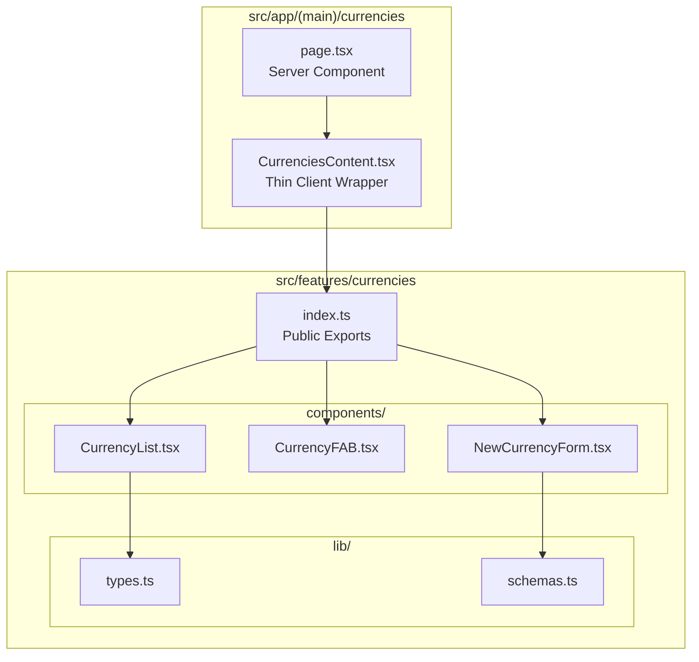

# Design Document

## Overview

通貨管理ページのUIコンポーネントを`src/features/currencies`に集約し、セッションページと同様のアーキテクチャパターン（FAB、ボトムシートドロワー、コンポーネント分離）を適用する。現在`src/app/(main)/currencies/`に密結合しているリスト表示・新規作成UIを、propsベースの再利用可能なコンポーネントに再構成する。

## Steering Document Alignment

### Technical Standards (tech.md)

- **TypeScript 5.8.2**: 全ファイルで厳密な型安全性を維持
- **Mantine v8.3.10**: 既存のUIコンポーネントライブラリを継続使用（Drawer, Affix, ActionIcon等）
- **Zod v3.24.2**: フォームバリデーションスキーマを`schemas.ts`に集約
- **React Query**: 既存のサーバー状態管理パターンを維持（アーカイブ切替時のlazy fetch）
- **Biome v2.2.5**: リンティング・フォーマッティング規約に準拠

### Project Structure (structure.md)

- **Single Responsibility**: 各ファイルは単一の責務を持つ
- **Co-location**: feature単位でコンポーネント、ロジック、テストを同一ディレクトリに配置
- **Public API**: `index.ts`でpublic exportsを定義し、内部実装を隠蔽
- **Naming Conventions**:
  - Components: `PascalCase.tsx`
  - Types: `types.ts`
  - Schemas: `schemas.ts`

## Code Reuse Analysis

### Existing Components to Leverage

- **Mantine Components**: `Drawer`, `Card`, `Button`, `Badge`, `Checkbox`, `Affix`, `ActionIcon`, `TextInput`, `NumberInput`
- **useDisclosure**: Mantineのフック（ドロワー状態管理）
- **zodResolver**: mantine-form-zod-resolverによるフォームバリデーション
- **notifications**: `@mantine/notifications`による成功/エラー通知

### Integration Points

- **tRPC Router** (`~/server/api/routers/currency/`): 通貨データ取得（`list`, `getById`等 - 変更なし）
- **Server Actions** (`~/app/(main)/currencies/actions/currency.ts`): 通貨作成（`createCurrency` - 変更なし）
- **App Router Pages**: `page.tsx`と`CurrenciesContent.tsx`は薄いラッパーとして維持
- **Zodスキーマ** (`~/server/api/schemas/currency.schema.ts`): サーバー側バリデーションスキーマ（変更なし）

## Architecture



### Modular Design Principles

- **Single File Responsibility**: 各ファイルは1つの明確な責務を持つ
- **Component Isolation**: UIコンポーネントはpropsのみに依存し、内部状態を最小限に
- **Service Layer Separation**: バリデーション（schemas）と型定義（types）をUIから分離
- **Utility Modularity**: セッションページと異なり、通貨はフィルタリング・フォーマット不要のため、`lib/`はtypes.tsとschemas.tsのみ

## Components and Interfaces

### CurrencyList

- **Purpose:** 通貨カードリストの表示、空状態の処理、アーカイブトグル
- **Interfaces:**
  ```typescript
  interface CurrencyListProps {
    currencies: Currency[]
    includeArchived: boolean
    onIncludeArchivedChange: (value: boolean) => void
    onOpenNewCurrency: () => void
  }
  ```
- **Dependencies:** `types.ts`, Mantine components (`Card`, `Stack`, `Group`, `Text`, `Checkbox`, `Badge`, `Button`)
- **Reuses:** 既存の`CurrenciesContent.tsx`のリスト表示UIを移行
- **設計意図:**
  - 通貨カードは`Link`で詳細ページに遷移（既存動作維持）
  - 空状態では「通貨が登録されていません」メッセージと新規作成ボタンを表示
  - `includeArchived`チェックボックスはコンポーネント内に配置（制御は親コンポーネントから）
  - アーカイブ済み通貨は`Badge`で視覚的に区別

### CurrencyFAB

- **Purpose:** Floating Action Buttonの表示（新規通貨作成ドロワーを開く）
- **Interfaces:**
  ```typescript
  interface CurrencyFABProps {
    onOpen: () => void
  }
  ```
- **Dependencies:** Mantine `Affix`, `ActionIcon`
- **Reuses:** `SessionFAB`と同一パターン（FABの共通デザイン）

### NewCurrencyForm

- **Purpose:** 新規通貨作成フォームUI（純粋なUIコンポーネント）
- **Interfaces:**
  ```typescript
  interface NewCurrencyFormProps {
    onSubmit: (data: NewCurrencyFormData) => void | Promise<void>
    isSubmitting?: boolean
    onCancel: () => void
  }

  // フォームから出力されるデータ型
  interface NewCurrencyFormData {
    name: string
    initialBalance: number
  }
  ```
- **Dependencies:** `schemas.ts`, Mantine components (`TextInput`, `NumberInput`, `Button`, `Stack`)
- **Reuses:** 既存の`NewCurrencyContent.tsx`のフォームUIを移行（Server Action呼び出しは親コンポーネントへ委譲）
- **設計意図:**
  - Server Actionの呼び出しをコンポーネント外部から注入（セッションフォームと同一パターン）
  - `onSubmit`でフォームデータのみを親に渡す
  - 成功後のページ遷移・通知は親コンポーネントの責務
  - `useForm` + `zodResolver`によるクライアントサイドバリデーション
  - `mode: 'uncontrolled'`でパフォーマンス最適化

## Data Models

### Currency (types.ts)

```typescript
interface Currency {
  id: string
  name: string
  currentBalance: number
  isArchived: boolean
}
```

**注記:** `RouterOutputs['currency']['list']['currencies'][number]`から必要なフィールドのみを抽出した型。featureモジュール内ではこの簡潔な型を使用し、APIレスポンス型との変換は`CurrenciesContent`で行う。

### NewCurrencyFormData (NewCurrencyForm.tsx)

```typescript
interface NewCurrencyFormData {
  name: string
  initialBalance: number
}
```

## Public API (index.ts)

```typescript
// Components
export { CurrencyList } from './components/CurrencyList'
export { CurrencyFAB } from './components/CurrencyFAB'
export { NewCurrencyForm } from './components/NewCurrencyForm'

// Types
export type { Currency } from './lib/types'
export type { NewCurrencyFormData } from './components/NewCurrencyForm'

// Schemas
export { newCurrencyFormSchema, type NewCurrencyFormInput } from './lib/schemas'
```

## CurrenciesContent (Thin Wrapper) の責務

`src/app/(main)/currencies/CurrenciesContent.tsx`は以下の責務のみを持つ薄いラッパー:

1. **状態管理**: `includeArchived`, ドロワーの開閉状態（`useDisclosure`）
2. **データフェッチ**: `api.currency.list.useQuery()`（既存パターン維持）
3. **Server Action呼び出し**: `createCurrency`の実行、成功時のリダイレクト・通知
4. **コンポーネント組み合わせ**: `CurrencyList`, `CurrencyFAB`, `NewCurrencyForm`をDrawer内で配置

```typescript
// 概要イメージ
export function CurrenciesContent({ initialCurrencies }: Props) {
  const [includeArchived, setIncludeArchived] = useState(false)
  const [opened, { open, close }] = useDisclosure(false)

  // ... データフェッチ（既存ロジック維持）

  const handleCreateCurrency = async (data: NewCurrencyFormData) => {
    const result = await createCurrency(data)
    if (result.success) {
      notifications.show({ ... })
      close()
      router.push(`/currencies/${result.data.id}`)
    }
  }

  return (
    <>
      <CurrencyList
        currencies={currencies}
        includeArchived={includeArchived}
        onIncludeArchivedChange={setIncludeArchived}
        onOpenNewCurrency={open}
      />
      <CurrencyFAB onOpen={open} />
      <Drawer opened={opened} onClose={close} position="bottom" ...>
        <NewCurrencyForm
          onSubmit={handleCreateCurrency}
          isSubmitting={isCreating}
          onCancel={close}
        />
      </Drawer>
    </>
  )
}
```

## Error Handling

### Error Scenarios

1. **フォームバリデーションエラー**
   - **Handling:** Zod + zodResolverによるクライアントサイドバリデーション
   - **User Impact:** 入力フィールド下にエラーメッセージを即座に表示

2. **通貨作成エラー（Server Action）**
   - **Handling:** Server Actionの`{ success: false, error }`レスポンスを処理
   - **User Impact:** エラーメッセージをnotificationsで赤色トースト表示
   - **ドロワー:** 閉じない（ユーザーが修正して再送信可能）

3. **アーカイブデータ読み込みエラー**
   - **Handling:** React Queryのエラー状態をAlert表示
   - **User Impact:** エラーメッセージを赤色Alertで表示（既存動作維持）

## Testing Strategy

### Integration Testing

- `CurrenciesContent`経由での全体フロー動作確認
- ドロワー開閉、フォーム送信、リスト更新の一連のフロー

### End-to-End Testing (Playwright)

- 既存のE2Eテストを維持
- リファクタリングによる動作変更がないことを確認
