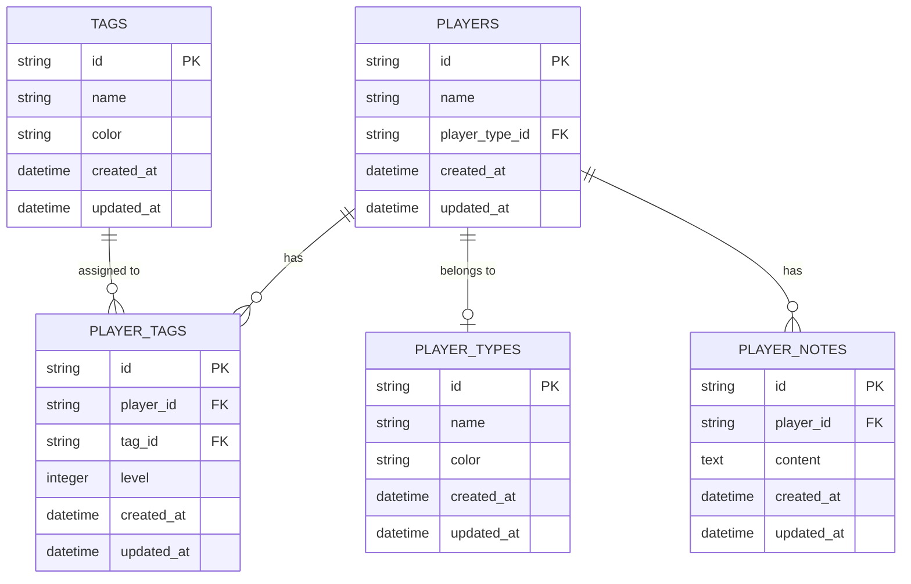
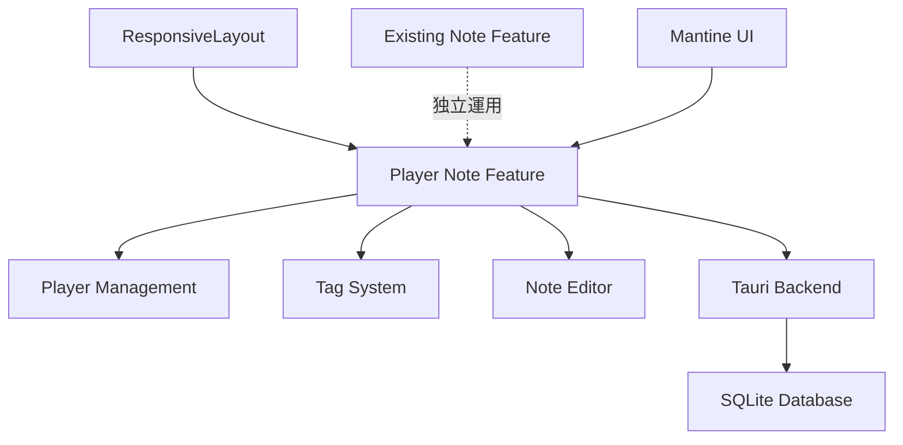

# Player Note アーキテクチャ設計

## システム概要

Player Note機能は、ライブポーカーゲーム中にプレイヤーの対戦相手に関する情報を管理する専用システムです。既存のNote機能から独立した新機能として設計され、カスタマイズ可能なプレイヤー分類、多重タグシステム、リッチテキストメモ機能を提供します。

🔵 **青信号**: EARS要件定義書に基づく設計

## アーキテクチャパターン

- **パターン**: Component-Based Architecture with Feature Modules
- **理由**:
  - 既存のresponsive-layoutシステムとの統合性
  - 機能別の分離とメンテナンス性
  - Mantine UIコンポーネントとの親和性
  - Tauriクロスプラットフォーム対応

🔵 **青信号**: 技術スタック定義書とresponsive-layout設計に基づく選択

## コンポーネント構成

### フロントエンド

- **フレームワーク**: React 18 + TypeScript 5.0+
- **状態管理**: React hooks + Context API（必要に応じてZustand検討）
- **UIライブラリ**: Mantine 7.x（共通ルールに従って可能な限り使用）
- **リッチテキストエディタ**: TipTap（REQ-106準拠）
- **スタイリング**: CSS Modules（技術スタック準拠）

🔵 **青信号**: 技術スタック定義書と要件定義書に明記されたフレームワーク

### バックエンド (Rust + Tauri)

- **フレームワーク**: Tauri 2.0+ Commands
- **データアクセス**: SQLite + rusqlite
- **シリアライゼーション**: serde
- **非同期処理**: tokio
- **ログ**: tracing

🔵 **青信号**: 技術スタック定義書に基づくRustスタック

### データベース

- **DBMS**: SQLite（技術スタック定義準拠）
- **ORM**: rusqlite（Raw SQL with type safety）
- **キャッシュ**: Tauri store API（設定管理用）
- **ストレージ**: ローカルファイルシステム（オフラインファースト）

🔵 **青信号**: 技術スタック定義書のデータストレージ方針

## データモデル設計

### エンティティ関係図



🟡 **黄信号**: 要件定義書のエンティティ要件から論理的に推測したリレーション設計

## フォルダ構造

```
src/
├── features/playernote/           # Player Note機能専用モジュール
│   ├── components/                # UI コンポーネント
│   │   ├── PlayerCard/           # プレイヤー表示カード
│   │   ├── PlayerForm/           # プレイヤー作成・編集フォーム
│   │   ├── PlayerList/           # プレイヤー一覧
│   │   ├── PlayerSearch/         # プレイヤー検索
│   │   ├── PlayerTypeManager/    # プレイヤータイプ管理
│   │   ├── TagManager/           # タグ管理
│   │   ├── TagSelector/          # タグ選択・レベル設定
│   │   └── RichTextEditor/       # TipTapエディタラッパー
│   ├── hooks/                    # Player Note専用hooks
│   │   ├── usePlayer.ts          # プレイヤー管理
│   │   ├── usePlayerType.ts      # プレイヤータイプ管理
│   │   ├── useTag.ts             # タグ管理
│   │   ├── usePlayerSearch.ts    # 検索機能
│   │   └── usePlayerNote.ts      # メモ機能
│   ├── context/                  # Context providers
│   │   └── PlayerNoteContext.tsx # Player Note状態管理
│   ├── types/                    # 型定義
│   │   └── playernote.ts         # Player Note関連型
│   └── utils/                    # ユーティリティ
│       ├── colorUtils.ts         # カラー生成・計算
│       └── tagLevelUtils.ts      # タグレベル処理
```

🟡 **黄信号**: 既存のresponsive-layout構造と要件から推測した適切なモジュール分割

## パフォーマンス要件対応

### 要件定義書指定パフォーマンス

- **プレイヤーリスト表示**: ≤ 1秒（NFR-101）
- **検索結果表示**: ≤ 500ms（NFR-102）
- **TipTapエディタ起動**: ≤ 300ms（NFR-103）
- **データベースクエリ**: ≤ 200ms（NFR-104）

🔵 **青信号**: 要件定義書の非機能要件に明記

### パフォーマンス最適化戦略

1. **仮想化リスト**: 大量プレイヤーデータ対応
2. **検索デバウンス**: 500ms以内応答保証
3. **レイジーローディング**: TipTapエディタの遅延初期化
4. **インデックス最適化**: SQLiteクエリ高速化
5. **メモ化**: React.memo, useMemo, useCallbackの活用

🟡 **黄信号**: パフォーマンス要件を満たすための一般的な最適化手法

## セキュリティ・品質要件

### データ整合性

- **カスケード削除**: プレイヤー削除時の関連データ削除（REQ-401）
- **参照整合性**: タグ・タイプ削除時の適切な処理（REQ-402）
- **競合解決**: Last Write Wins方式（REQ-403）

🔵 **青信号**: 要件定義書の制約要件に明記

### 品質基準（技術スタック準拠）

- **テストカバレッジ**: 80%以上
- **TypeScript**: strict mode
- **コード品質**: ESLint + Prettier準拠
- **アクセシビリティ**: WCAG AA準拠

🔵 **青信号**: 技術スタック定義書の品質基準

## 統合アーキテクチャ

### 既存システムとの関係



🔵 **青信号**: 既存のresponsive-layout設計との統合として明確に定義

### 段階的移行戦略

1. **Phase 1**: Player Note機能の独立実装
2. **Phase 2**: 既存Note機能との並行運用
3. **Phase 3**: 段階的な移行とNote機能置き換え

🟡 **黄信号**: 要件定義書の段階的開発計画から推測

## 今後の拡張性

### Phase 2対応設計

- **HTMLテンプレート機能**: プレイヤー作成時のテンプレート
- **複合検索**: タグ + レベル + 日時範囲での検索

### Phase 3対応設計

- **高度フィルタリング**: 保存可能な検索条件
- **プレイヤー統計**: 分析機能とレポート

🔵 **青信号**: 要件定義書のPhase 2, 3要件に基づく拡張性考慮