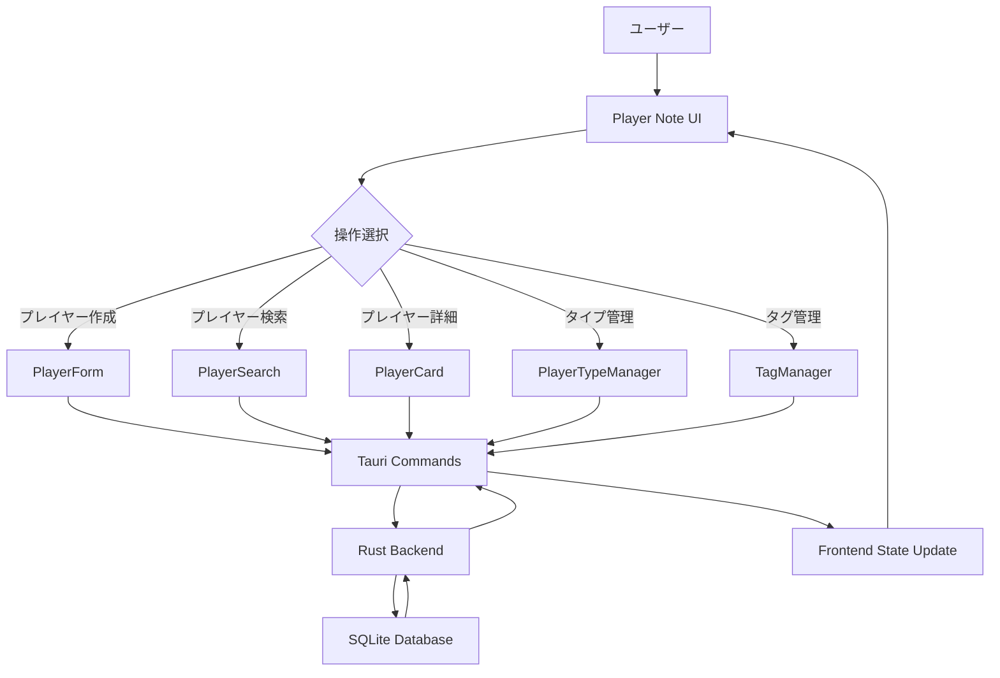
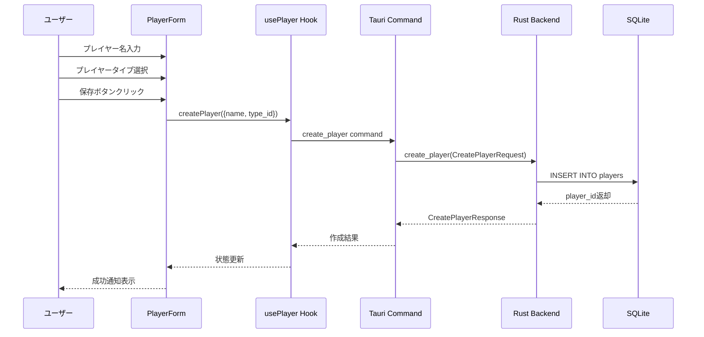
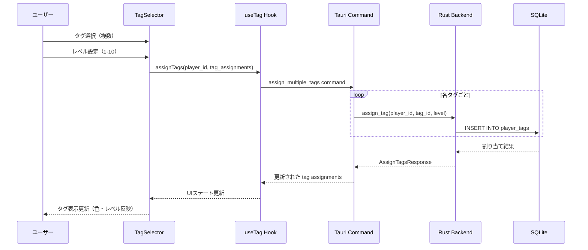
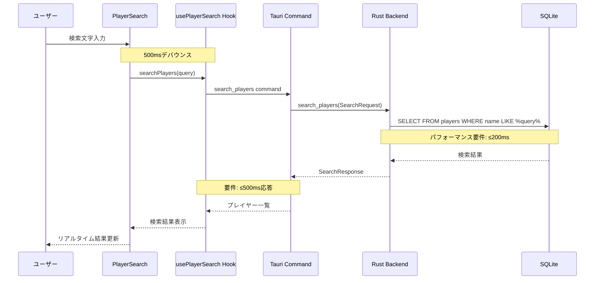
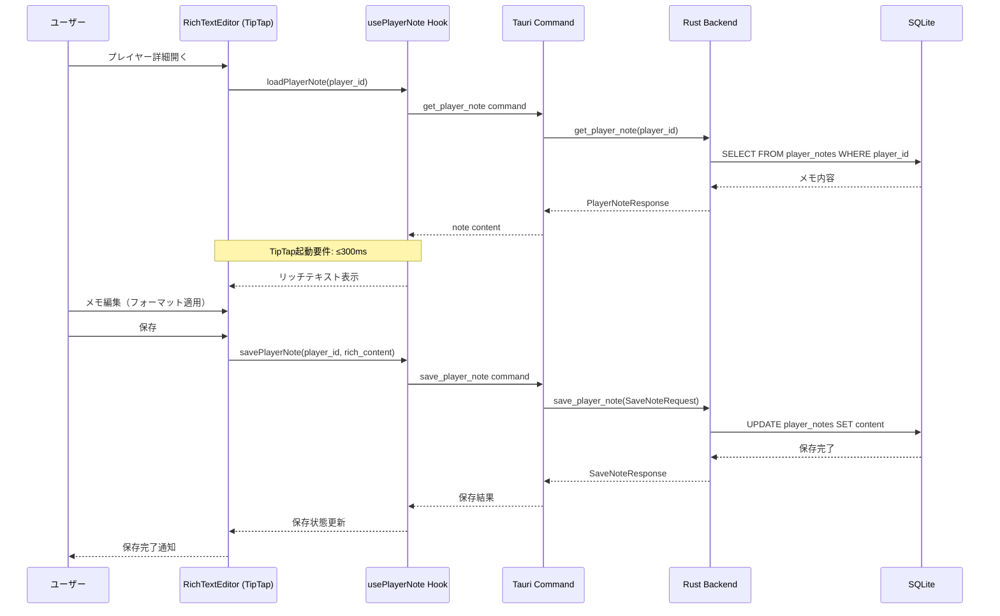
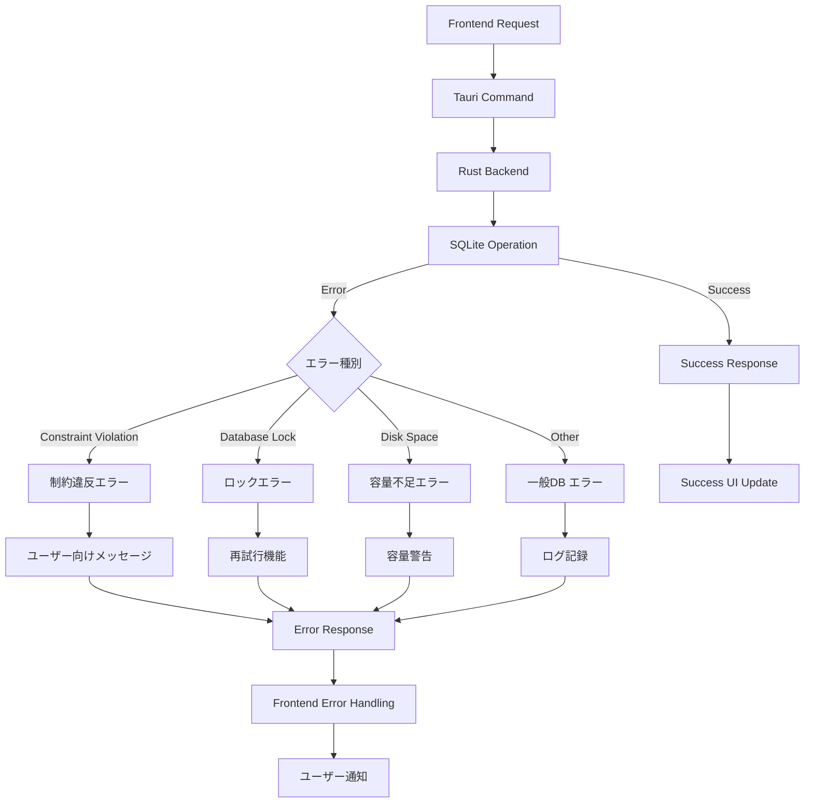
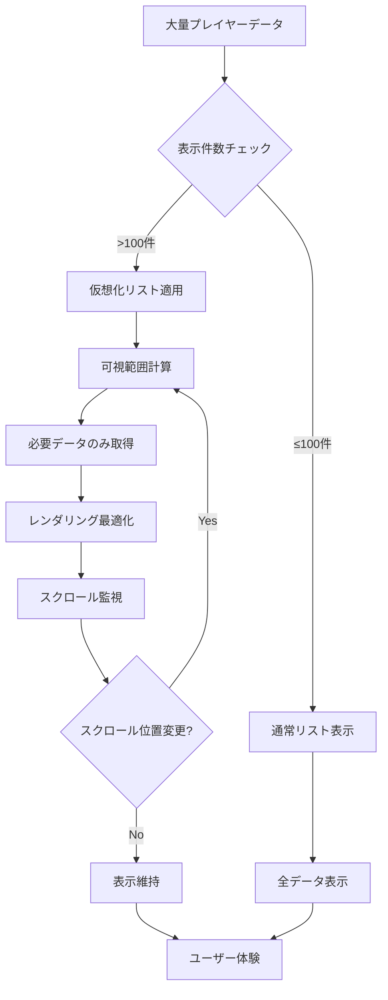
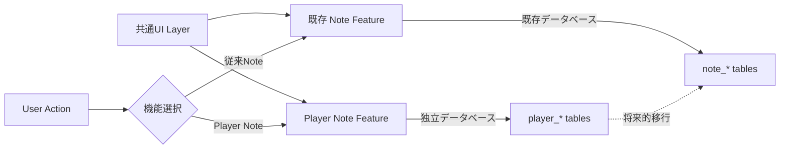
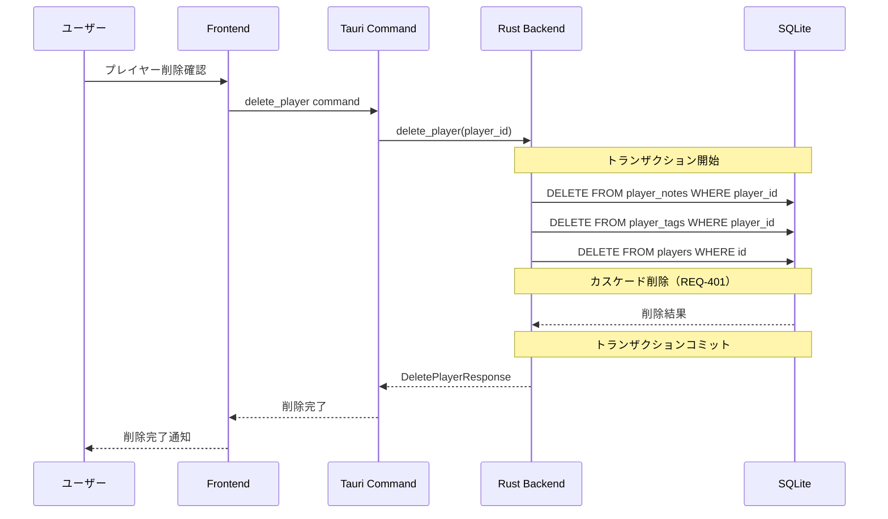

# Player Note データフロー図

## ユーザーインタラクションフロー

### メイン機能フロー

🔵 **青信号**: 要件定義書のエピック構造（プレイヤー管理、分類システム、タグシステム、メモ機能、検索機能）に基づく

## データ処理フロー

### プレイヤー作成フロー

🔵 **青信号**: REQ-001（プレイヤー管理）とREQ-002（プレイヤータイプ）に基づく

### 多重タグ割り当てフロー

🔵 **青信号**: REQ-003（多重タグシステム）とREQ-104, REQ-105（レベル設定）に基づく

### リアルタイム検索フロー

🔵 **青信号**: REQ-005（検索機能）とNFR-102（500ms応答時間）に基づく

### リッチテキストメモ編集フロー

🔵 **青信号**: REQ-004（リッチテキストメモ）、REQ-106（TipTap）、NFR-103（300ms起動）に基づく

## エラーハンドリングフロー

### データベースエラー処理

🟡 **黄信号**: 要件定義書のエラー処理要件とTauriアプリの一般的なエラーハンドリングから推測

## パフォーマンス最適化フロー

### 仮想化リスト処理

🟡 **黄信号**: NFR-101（1秒以内表示）要件を満たすための一般的な最適化手法

## システム間連携フロー

### 既存Note機能との独立性保証

🔵 **青信号**: 要件定義書で明確に指定された「既存Note機能からの独立性」

## データ整合性保証フロー

### カスケード削除処理

🔵 **青信号**: REQ-401（カスケード削除）要件に基づく整合性保証処理