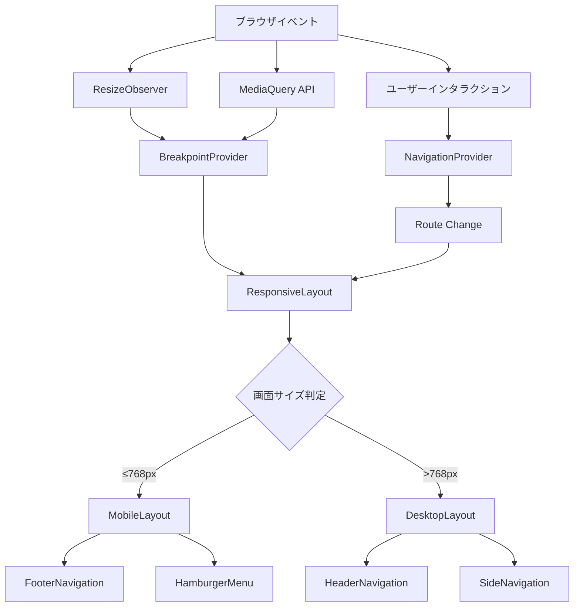
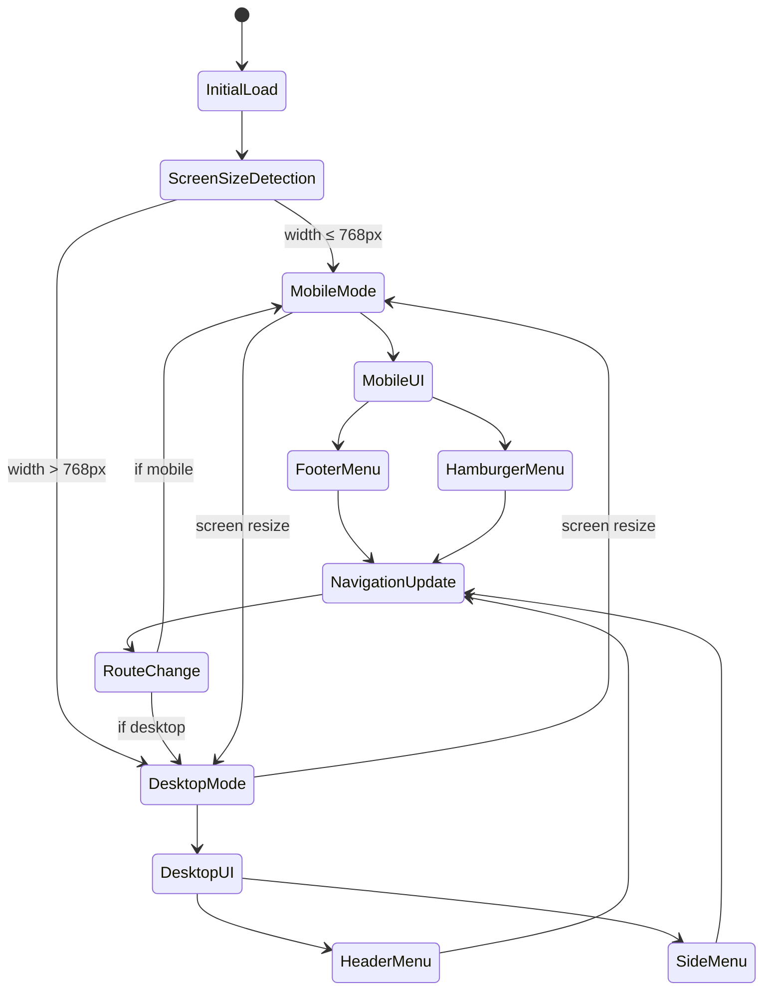
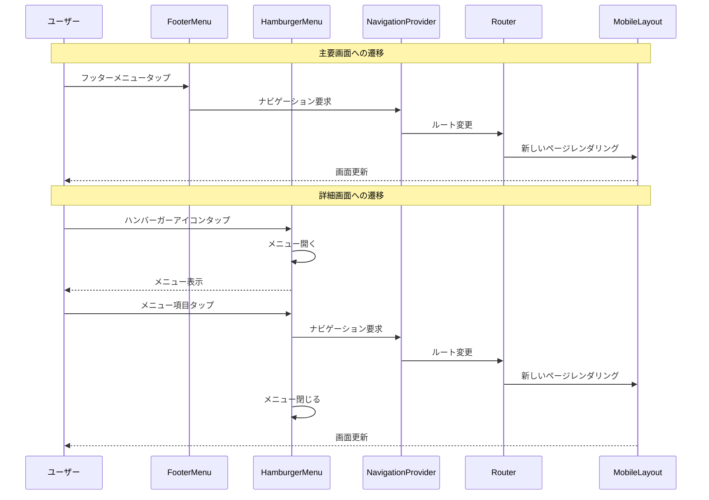
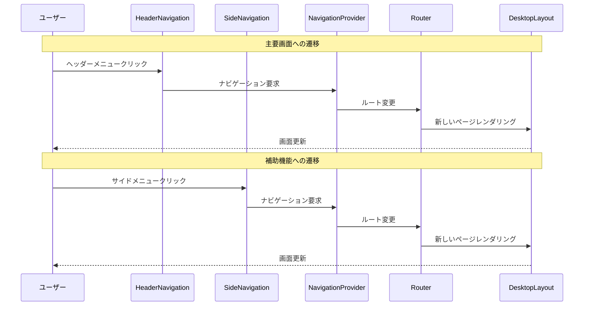
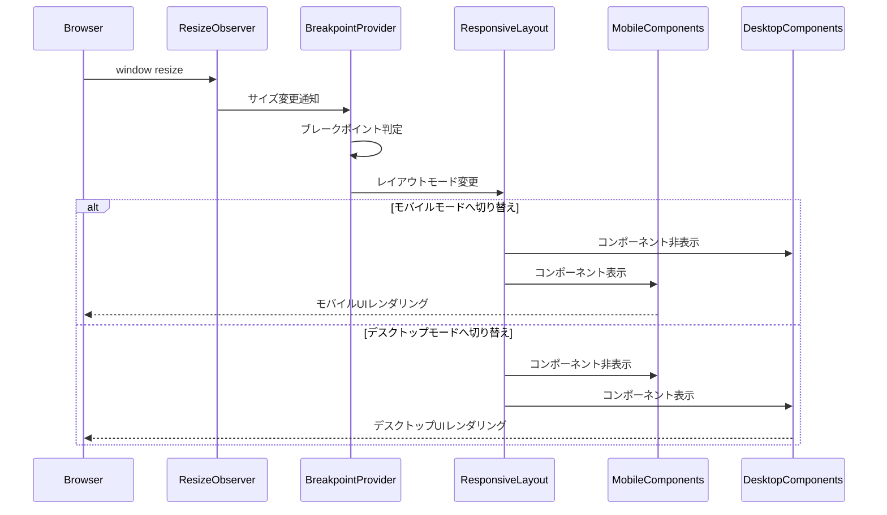
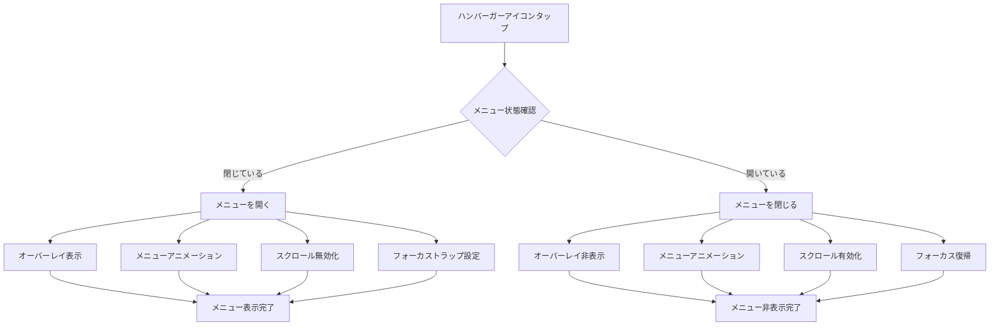
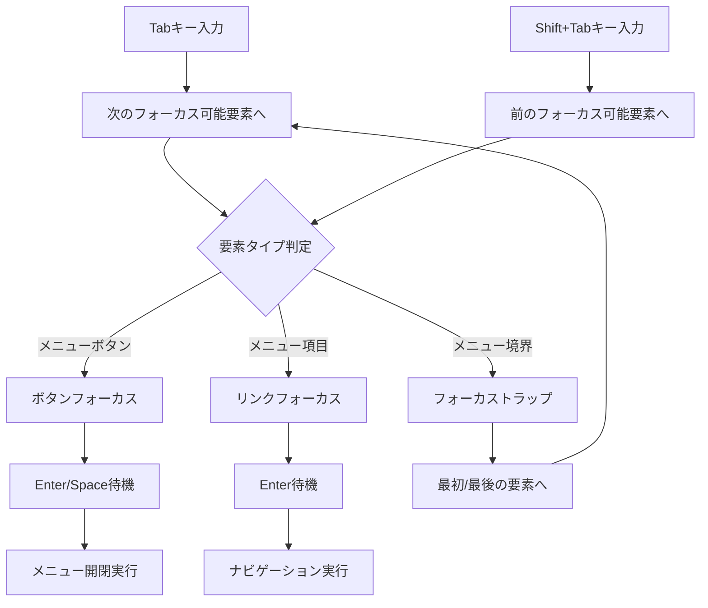
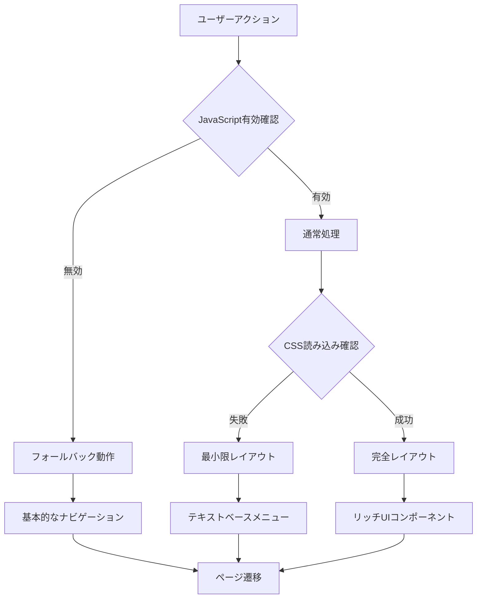
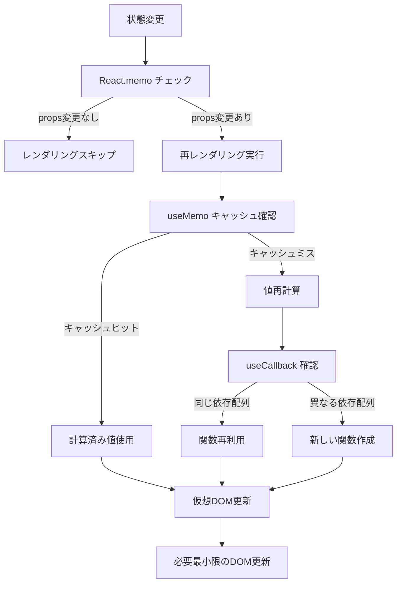

# レスポンシブレイアウト データフロー図

## システム全体のデータフロー

## レスポンシブ状態管理フロー

## ユーザーインタラクションフロー

### モバイルユーザーのナビゲーション

### デスクトップユーザーのナビゲーション

## 画面サイズ変更時のフロー

## メニュー状態管理フロー

### ハンバーガーメニューの開閉

## アクセシビリティフロー

### キーボードナビゲーション

## エラーハンドリングフロー

## パフォーマンス最適化フロー

### レンダリング最適化

