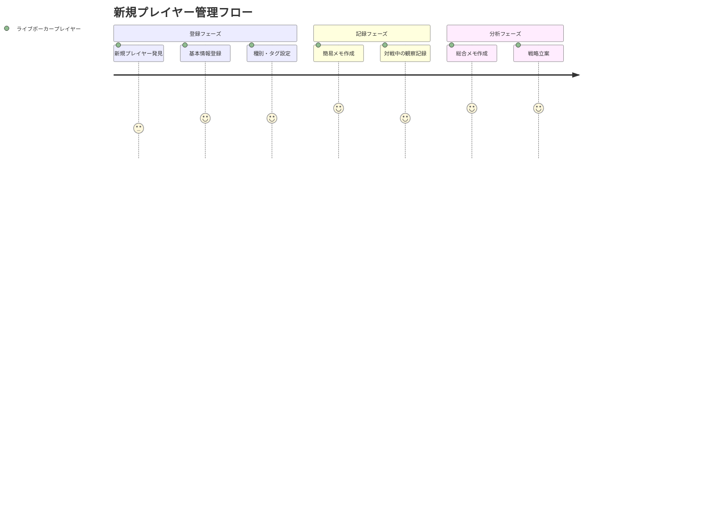

# プレイヤーノート機能 ユーザストーリー

## 概要

このドキュメントはプレイヤーノート機能の詳細なユーザストーリーを記載します。

## ユーザー種別の定義

### プライマリユーザー

- **ライブポーカープレイヤー**: ライブポーカーをプレイし、対戦相手の情報を管理したいプレイヤー
- **ポーカー学習者**: 復習や分析を通じてスキル向上を目指すプレイヤー

### セカンダリユーザー

- **ポーカーコーチ**: 生徒の対戦相手分析をサポートする指導者
- **トーナメントプレイヤー**: 定期的な対戦相手の詳細な記録を残したいプレイヤー

## ユーザストーリー

**【信頼性レベル凡例】**:
- 🔵 **青信号**: Linear情報・ユーザヒアリングに基づく確実なストーリー
- 🟡 **黄信号**: Linear情報・ヒアリングから妥当な推測によるストーリー
- 🔴 **赤信号**: 推測によるストーリー（要確認）

### 📚 エピック1: プレイヤー基本管理 🔵 *Linear Project Description + ユーザヒアリングより*

#### ストーリー1.1: 新規プレイヤー登録 🔵 *ユーザヒアリング2024-09-29より*

**ユーザストーリー**:
- **私は** ライブポーカープレイヤー **として**
- **新しい対戦相手と遭遇した際に**
- **その人の名前と簡単な識別情報を素早く登録したい**
- **そうすることで** 後で詳細な分析や情報を追加できる基盤を作ることができる

**詳細説明**:
- **背景**: 新しい対戦相手に遭遇する度に、その場で基本情報を記録したい
- **前提条件**: 対戦相手の名前を知っている
- **利用シーン**: ゲーム開始前やブレイク中の短時間
- **期待する体験**: 数タップで素早く登録完了

**関連要件**: REQ-001, REQ-002

**優先度**: 高

#### ストーリー1.2: 同名プレイヤーの区別 🔵 *ユーザヒアリング2024-09-29より*

**ユーザストーリー**:
- **私は** ライブポーカープレイヤー **として**
- **既に登録済みの名前と同じプレイヤーを登録しようとした時に**
- **別人であることを明確に区別できるようにしたい**
- **そうすることで** 誤った情報の混同を防ぎ、正確な記録を保てる

**詳細説明**:
- **背景**: 同名の異なるプレイヤーは実際に存在する
- **前提条件**: 既に同じ名前のプレイヤーが登録済み
- **利用シーン**: 新規プレイヤー登録時
- **期待する体験**: システムが重複を検知し、識別子入力を促す

**関連要件**: REQ-101

**優先度**: 中

### 📚 エピック2: プレイヤー分類・タグ管理 🔵 *Linear Project Description + ユーザヒアリングより*

#### ストーリー2.1: プレイヤー種別の設定 🔵 *ユーザヒアリング2024-09-29より*

**ユーザストーリー**:
- **私は** ライブポーカープレイヤー **として**
- **対戦相手のスキルレベルを視覚的に分類したい**
- **カスタムの色と名称で種別を作成し、各プレイヤーに割り当てたい**
- **そうすることで** 一目でプレイヤーの強さレベルを把握できる

**詳細説明**:
- **背景**: プレイヤーの強さを素早く識別したい
- **前提条件**: プレイヤーが登録済み
- **利用シーン**: プレイヤー情報の整理時
- **期待する体験**: 直感的な色分けによる視覚的分類

**関連要件**: REQ-003, REQ-201

**優先度**: 高

#### ストーリー2.2: レベル付きタグの設定 🔵 *Linear Project Description + ユーザヒアリングより*

**ユーザストーリー**:
- **私は** ライブポーカープレイヤー **として**
- **プレイヤーの特徴をより詳細にタグ付けしたい**
- **同じタグでもその強度をローマ数字レベル（I-V）で表現したい**
- **そうすることで** より精密な対戦相手分析ができる

**詳細説明**:
- **背景**: 単純なタグ付けでは情報が不十分
- **前提条件**: タグマスタが作成済み
- **利用シーン**: 詳細な対戦相手分析時
- **期待する体験**: レベルに応じた色の濃淡とローマ数字表示

**関連要件**: REQ-004, REQ-005, REQ-006, NFR-103

**優先度**: 高

### 📚 エピック3: メモ・分析機能 🔵 *Linear Project Descriptionより*

#### ストーリー3.1: 簡易メモの作成 🔵 *Linear Project Description + ユーザヒアリングより*

**ユーザストーリー**:
- **私は** ライブポーカープレイヤー **として**
- **対戦中に気になったハンド履歴やプレイスタイルを素早くメモしたい**
- **リッチテキストエディタで簡潔に記録したい**
- **そうすることで** 後で詳細分析時に参考にできる

**詳細説明**:
- **背景**: 対戦中の気づきをその場で記録したい
- **前提条件**: プレイヤーが登録済み
- **利用シーン**: ゲーム中やブレイク中
- **期待する体験**: 300ms以内でエディタが起動し、素早く入力可能

**関連要件**: REQ-007, TECH-003, TECH-006, NFR-003

**優先度**: 高

#### ストーリー3.2: 総合メモの管理 🔵 *Linear Project Descriptionより*

**ユーザストーリー**:
- **私は** ライブポーカープレイヤー **として**
- **各プレイヤーの包括的な分析を一箇所にまとめたい**
- **総合的な評価やストラテジーを詳細に記録したい**
- **そうすることで** 次回対戦時に戦略を立てやすくなる

**詳細説明**:
- **背景**: 散発的なメモを統合した分析が必要
- **前提条件**: プレイヤー登録時に自動作成される
- **利用シーン**: 復習時や次回対戦準備時
- **期待する体験**: 体系的で読みやすい包括的な記録

**関連要件**: REQ-008, REQ-202

**優先度**: 中

### 📚 エピック4: 検索・表示機能 🔵 *ユーザヒアリング2024-09-29より*

#### ストーリー4.1: プレイヤー検索 🔵 *ユーザヒアリング2024-09-29より*

**ユーザストーリー**:
- **私は** ライブポーカープレイヤー **として**
- **以前対戦したプレイヤーを素早く見つけたい**
- **名前や識別子での部分一致検索を行いたい**
- **そうすることで** 過去の記録を効率的に参照できる

**詳細説明**:
- **背景**: 多数のプレイヤーから特定の人を見つけたい
- **前提条件**: 複数のプレイヤーが登録済み
- **利用シーン**: 対戦前の情報確認時
- **期待する体験**: 500ms以内で検索結果が表示される

**関連要件**: REQ-009, NFR-002

**優先度**: 中

#### ストーリー4.2: 表示方式の切り替え 🔵 *ユーザヒアリング2024-09-29より*

**ユーザストーリー**:
- **私は** ライブポーカープレイヤー **として**
- **状況に応じてプレイヤー一覧の表示形式を変更したい**
- **リスト表示とカード表示を使い分けたい**
- **そうすることで** 効率的な情報閲覧ができる

**詳細説明**:
- **背景**: 表示する情報量や用途により最適な表示が異なる
- **前提条件**: 複数のプレイヤーが登録済み
- **利用シーン**: 一覧確認時や詳細確認時
- **期待する体験**: ワンタップで表示方式を切り替え可能

**関連要件**: REQ-010

**優先度**: 低

### 📚 エピック5: データ管理・安全性 🔵 *ユーザヒアリング2024-09-29より*

#### ストーリー5.1: 安全な削除 🔵 *ユーザヒアリング2024-09-29より*

**ユーザストーリー**:
- **私は** ライブポーカープレイヤー **として**
- **不要になったプレイヤー情報を安全に削除したい**
- **削除前に確認ダイアログで最終確認を行いたい**
- **そうすることで** 誤削除を防ぎ、重要なデータを保護できる

**詳細説明**:
- **背景**: 一度削除した情報は復元困難
- **前提条件**: 削除対象のプレイヤーが存在する
- **利用シーン**: データ整理時
- **期待する体験**: 明確な確認プロセスによる安全な削除

**関連要件**: REQ-102, REQ-303

**優先度**: 中

#### ストーリー5.2: データエクスポート 🔵 *ユーザヒアリング2024-09-29より*

**ユーザストーリー**:
- **私は** ライブポーカープレイヤー **として**
- **蓄積したプレイヤー情報をバックアップしたい**
- **JSON形式でデータをエクスポートしたい**
- **そうすることで** データの安全性を確保し、他の用途にも活用できる

**詳細説明**:
- **背景**: 長期間蓄積したデータは貴重な資産
- **前提条件**: 複数のプレイヤーデータが存在する
- **利用シーン**: 定期的なバックアップ時
- **期待する体験**: ワンクリックでの完全なデータエクスポート

**関連要件**: REQ-103

**優先度**: 低

## ユーザージャーニー

### ジャーニー1: 新規プレイヤー登録から分析まで 🔵 *全体的なユーザヒアリングより*

**詳細**:
1. **新規プレイヤー発見**: 対戦相手との初回遭遇
2. **基本情報登録**: 名前・識別子の登録
3. **種別・タグ設定**: 初期分類の実施
4. **簡易メモ作成**: リアルタイムでの観察記録
5. **対戦中の観察記録**: 継続的な情報蓄積
6. **総合メモ作成**: 包括的な分析の実施
7. **戦略立案**: 次回対戦に向けた準備

## ペルソナ定義

### ペルソナ1: 田中 健太（中級ライブプレイヤー） 🔵 *ユーザヒアリング想定より*

- **基本情報**: 30代、会社員、週2-3回ライブポーカー参加、経験年数3年
- **ゴール**: レギュラーメンバーの傾向を把握し、勝率向上を図りたい
- **課題**: 多数の対戦相手の特徴を覚えきれない
- **行動パターン**: ゲーム中にスマホでメモを取る、復習を重視する
- **利用環境**: iPhone、iPad、対戦中・移動中・自宅での利用

### ペルソナ2: 佐藤 美由紀（上級トーナメントプレイヤー） 🟡 *妥当な推測*

- **基本情報**: 20代、プロプレイヤー、月10回以上大会参加、経験年数7年
- **ゴール**: 全国の強豪プレイヤーの詳細な分析データベース構築
- **課題**: 大量の対戦相手情報の体系的管理
- **行動パターン**: 試合後に詳細な分析レポート作成、データ駆動の戦略立案
- **利用環境**: MacBook、移動中のスマホ利用、ホテルでの詳細分析

## 非機能的ユーザー要求

### ユーザビリティ要求 🔵 *ユーザヒアリング2024-09-29より*

- **学習容易性**: 初回利用時に5分以内で基本操作を習得可能
- **効率性**: 新規プレイヤー登録を30秒以内で完了可能
- **記憶しやすさ**: 1週間間隔での利用でも操作方法を覚えている
- **エラー対応**: 誤操作時の明確なエラーメッセージと復旧手順
- **満足度**: モバイル環境での快適な操作感

### アクセシビリティ要求 🟡 *妥当な推測*

- **視覚**: 十分なコントラスト比による文字の視認性確保
- **聴覚**: 音声に依存しない操作（全て視覚的操作で完結）
- **運動**: 片手操作可能なUI設計（対戦中の利用を考慮）
- **認知**: シンプルで直感的なナビゲーション構造

## 成功指標

### 利用状況指標 🟡 *想定される成功指標*

- プレイヤー登録数: 個人あたり平均50人以上
- メモ作成頻度: 週平均10件以上の簡易メモ作成
- 検索利用率: 登録プレイヤーの70%以上が定期的に検索される
- エディタ起動時間: 300ms以内の達成率95%以上

### ユーザー満足度指標 🟡 *想定される満足度指標*

- モバイル利用満足度: 5段階評価で4以上
- 機能完了率: タスク完了率90%以上
- リピート利用率: 継続利用率80%以上（3ヶ月後）