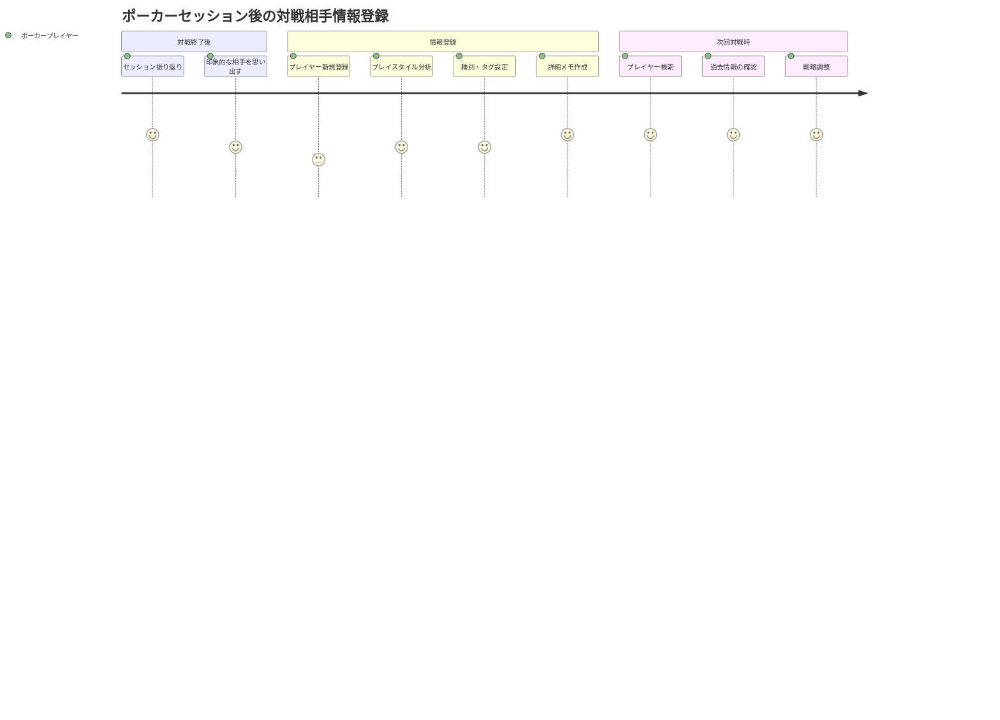
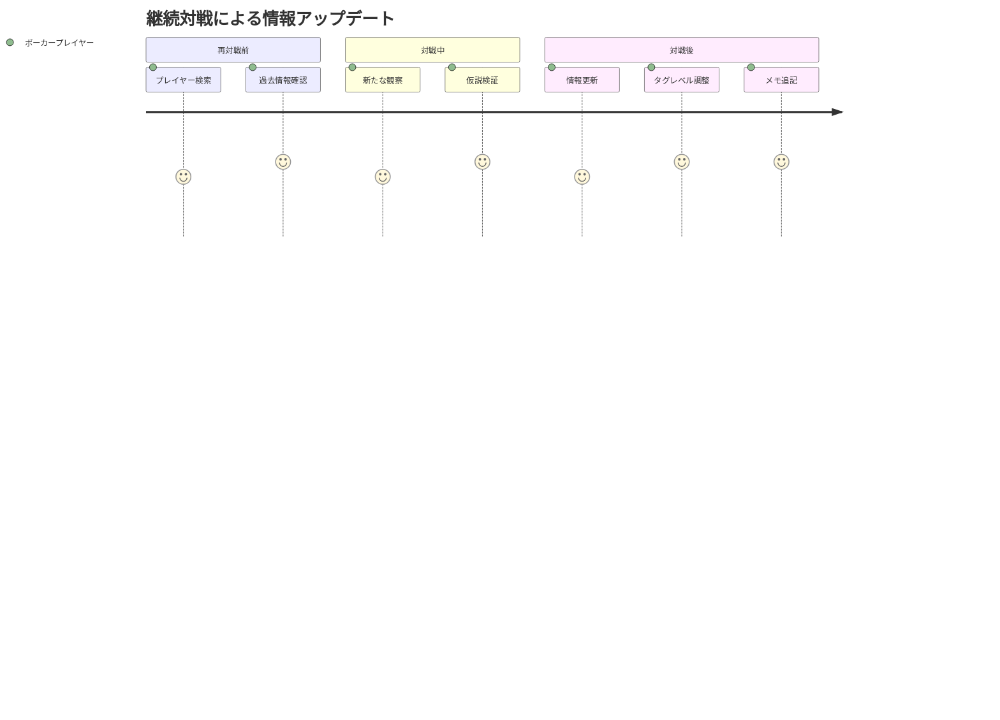

# プレイヤーノート機能 ユーザストーリー

## 概要

このドキュメントはプレイヤーノート機能の詳細なユーザストーリーを記載します。ライブポーカーでの対戦相手管理という特化した用途に焦点を当てています。

## ユーザー種別の定義

### プライマリユーザー

- **ポーカープレイヤー**: ライブポーカーで継続的にプレイし、対戦相手の情報を記録・活用したいプレイヤー
- **ポーカー学習者**: ポーカーの技術向上のため、対戦相手の分析を通じて自身のプレイを改善したいプレイヤー

### セカンダリユーザー

- **ポーカーコーチ**: 生徒の対戦相手分析をサポートする指導者
- **ポーカーチーム**: チーム内で対戦相手情報を共有する組織

## ユーザストーリー

**【信頼性レベル凡例】**:
- 🔵 **青信号**: Linear要件定義・ユーザヒアリングを参考にした確実なストーリー
- 🟡 **黄信号**: Linear要件定義・ユーザヒアリングから妥当な推測によるストーリー
- 🔴 **赤信号**: Linear要件定義・ユーザヒアリングにない推測によるストーリー

### 📚 エピック1: プレイヤー基本管理 🔵 *Linear要件定義・ユーザヒアリング2024-09-24より*

#### ストーリー1.1: プレイヤー新規登録 🔵 *ユーザヒアリング必須機能より*

**ユーザストーリー**:
- **私は** ポーカープレイヤー **として**
- **新しい対戦相手と対戦した後に**
- **その相手の名前を記録したい**
- **そうすることで** 次回対戦時に識別できる

**詳細説明**:
- **背景**: ライブポーカーでは同じ相手と複数回対戦することが多く、過去の情報が有用
- **前提条件**: 新しい対戦相手の情報が未登録の状態
- **利用シーン**: セッション終了後の復習時、または対戦中のメモ取り時
- **期待する体験**: 簡単な操作で素早くプレイヤーを登録できる

**関連要件**: REQ-001, REQ-006

**優先度**: 高

**見積もり**: 3ストーリーポイント

#### ストーリー1.2: プレイヤー情報編集 🔵 *基本CRUD機能として*

**ユーザストーリー**:
- **私は** ポーカープレイヤー **として**
- **プレイヤーの情報に誤りがあったり追加情報を得た場合に**
- **登録済みプレイヤーの基本情報を修正したい**
- **そうすることで** 正確な情報を維持できる

**詳細説明**:
- **背景**: プレイヤー名の間違い、より詳細な情報の追加が発生する
- **前提条件**: 既にプレイヤーが登録済みの状態
- **利用シーン**: 情報の訂正が必要になった時
- **期待する体験**: 既存情報を保持したまま部分的な修正が可能

**関連要件**: REQ-001

**優先度**: 高

**見積もり**: 2ストーリーポイント

### 📚 エピック2: カスタマイズ可能な分類システム 🔵 *Linear要件定義・ユーザヒアリング2024-09-24より*

#### ストーリー2.1: プレイヤー種別の設定 🔵 *ユーザヒアリング必須機能より*

**ユーザストーリー**:
- **私は** ポーカープレイヤー **として**
- **対戦相手の大まかなプレイスタイルを把握した場合に**
- **そのプレイヤーに種別（例：アグレッシブ、コンサバティブ）を設定したい**
- **そうすることで** 一目でプレイスタイルの傾向を把握できる

**詳細説明**:
- **背景**: ポーカーでは相手のプレイスタイルの把握が戦略上重要
- **前提条件**: プレイヤーが登録済み、種別マスタが作成済み
- **利用シーン**: 対戦相手の分析が完了した時
- **期待する体験**: 色と名前でプレイスタイルを視覚的に識別できる

**関連要件**: REQ-002, REQ-101, REQ-102

**優先度**: 高

**見積もり**: 5ストーリーポイント

#### ストーリー2.2: カスタム種別の作成 🔵 *ユーザヒアリング必須機能より*

**ユーザストーリー**:
- **私は** ポーカープレイヤー **として**
- **自分なりのプレイヤー分類方法を使いたい場合に**
- **色と名称を自由に設定できる種別を作成したい**
- **そうすることで** 自分の分析方法に合った分類ができる

**詳細説明**:
- **背景**: ポーカープレイヤーごとに分析方法や専門用語が異なる
- **前提条件**: システムが起動している状態
- **利用シーン**: 初回設定時、または分析手法を変更する時
- **期待する体験**: 色選択と名前入力で簡単に種別を作成できる

**関連要件**: REQ-002, REQ-101

**優先度**: 高

**見積もり**: 3ストーリーポイント

### 📚 エピック3: レベル付きタグシステム 🔵 *Linear要件定義・ユーザヒアリング2024-09-24より*

#### ストーリー3.1: 複数タグの割り当て 🔵 *ユーザヒアリング必須機能より*

**ユーザストーリー**:
- **私は** ポーカープレイヤー **として**
- **1人のプレイヤーに複数の特徴がある場合に**
- **そのプレイヤーに複数のタグを同時に割り当てたい**
- **そうすることで** 多面的な特徴を記録できる

**詳細説明**:
- **背景**: プレイヤーは複数の特徴を持つ（例：アグレッシブかつブラフ好き）
- **前提条件**: プレイヤーとタグが登録済み
- **利用シーン**: 詳細な分析結果をタグ付けする時
- **期待する体験**: 複数選択でタグを一括割り当てできる

**関連要件**: REQ-003

**優先度**: 高

**見積もり**: 4ストーリーポイント

#### ストーリー3.2: タグレベルの設定 🔵 *ユーザヒアリング必須機能より*

**ユーザストーリー**:
- **私は** ポーカープレイヤー **として**
- **同じ特徴でも強さが異なる場合に**
- **タグにレベルを設定して強度を表現したい**
- **そうすることで** より精密な分析情報を記録できる

**詳細説明**:
- **背景**: 「アグレッシブ」でもレベル3とレベル8では戦略が変わる
- **前提条件**: プレイヤーにタグが割り当て済み
- **利用シーン**: 詳細な分析でタグの強度を調整する時
- **期待する体験**: レベル設定と色の濃淡で直感的に強度を把握できる

**関連要件**: REQ-104, REQ-105

**優先度**: 高

**見積もり**: 5ストーリーポイント

### 📚 エピック4: リッチテキストメモ機能 🔵 *Linear要件定義・ユーザヒアリング2024-09-24より*

#### ストーリー4.1: 詳細メモの作成 🔵 *ユーザヒアリング必須機能より*

**ユーザストーリー**:
- **私は** ポーカープレイヤー **として**
- **対戦相手の具体的な行動パターンを記録したい場合に**
- **フォーマット付きで読みやすいメモを作成したい**
- **そうすることで** 後で見返した時に理解しやすい情報を残せる

**詳細説明**:
- **背景**: 単純なテキストではハンドの詳細や状況説明が読みにくい
- **前提条件**: プレイヤーが登録済み
- **利用シーン**: セッション後の詳細な復習・分析時
- **期待する体験**: TipTapエディタで太字、箇条書き等を使って整理された文書を作成できる

**関連要件**: REQ-004, REQ-106

**優先度**: 高

**見積もり**: 8ストーリーポイント

### 📚 エピック5: 基本検索機能 🔵 *Linear要件定義・ユーザヒアリング2024-09-24より*

#### ストーリー5.1: プレイヤー名での検索 🔵 *ユーザヒアリング必須機能より*

**ユーザストーリー**:
- **私は** ポーカープレイヤー **として**
- **多数のプレイヤーが登録されている状況で**
- **名前の一部を入力して目的のプレイヤーを素早く見つけたい**
- **そうすることで** 効率的にプレイヤー情報にアクセスできる

**詳細説明**:
- **背景**: 数百人のプレイヤーが登録されるとスクロールでの検索は非効率
- **前提条件**: 複数のプレイヤーが登録済み
- **利用シーン**: 対戦前の情報確認、過去のデータ参照時
- **期待する体験**: リアルタイムで検索結果が絞り込まれる

**関連要件**: REQ-005

**優先度**: 高

**見積もり**: 3ストーリーポイント

## ユーザージャーニー

### ジャーニー1: 新規対戦相手の情報登録フロー 🔵 *基本的な利用フロー*

**詳細**:
1. **セッション振り返り**: ポーカーセッション終了後の復習タイム
2. **印象的な相手を思い出す**: 記録に値する対戦相手を選定
3. **プレイヤー新規登録**: 基本情報（名前）の登録
4. **プレイスタイル分析**: 観察した特徴の分析・整理
5. **種別・タグ設定**: 分析結果のカテゴライズ
6. **詳細メモ作成**: 具体的なハンドや行動パターンの記録
7. **プレイヤー検索**: 次回対戦時の情報確認
8. **過去情報の確認**: 蓄積された分析情報の活用
9. **戦略調整**: 情報に基づく対戦戦略の決定

### ジャーニー2: 既存プレイヤー情報の更新フロー 🔵 *継続的な情報蓄積*

## ペルソナ定義

### ペルソナ1: 真剣なアマチュアプレイヤー（田中さん） 🔵 *想定メインユーザー*

- **基本情報**: 30代、会社員、週2-3回のライブポーカー
- **ゴール**: ポーカー技術を向上させて収益を安定させる
- **課題**: 多数の対戦相手の特徴を記憶しきれない
- **行動パターン**: セッション後に必ず復習、データに基づく戦略調整を好む
- **利用環境**: 主にデスクトップ、たまにタブレット

### ペルソナ2: セミプロプレイヤー（佐藤さん） 🟡 *上級ユーザー*

- **基本情報**: 20代、ポーカーが主要収入源、毎日プレイ
- **ゴール**: 対戦相手の詳細分析で競争優位を獲得
- **課題**: 膨大な対戦相手情報の効率的な管理
- **行動パターン**: 詳細なメモ取り、統計的な分析を重視
- **利用環境**: デスクトップ中心、スマートフォンでのメモ確認

## 非機能的ユーザー要求

### ユーザビリティ要求

- **学習容易性**: 初回利用時に30分以内で基本操作を習得
- **効率性**: 熟練後は1プレイヤーの詳細登録を5分以内で完了
- **記憶しやすさ**: 1週間使用停止後でも操作方法を思い出せる
- **エラー対応**: 操作ミス時の復旧が直感的に可能
- **満足度**: ポーカー特化機能による高い実用性

### アクセシビリティ要求

- **視覚**: 色以外でもタグ・種別の区別が可能
- **聴覚**: 音声に依存する機能は使用しない
- **運動**: マウスとキーボードの両方で操作可能
- **認知**: 複雑な階層構造を避けた直感的なUI