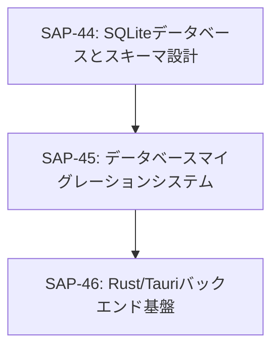

# Phase 1: Infrastructure & Database

## 📋 フェーズ概要
- **フェーズ名**: Infrastructure & Database
- **期間**: 5日（40時間）
- **タスク数**: 3タスク
- **開始日**: 2025-09-30（想定）
- **完了予定日**: 2025-10-04（想定）

## 🎯 フェーズ目標
プレイヤーノート機能の基盤となるデータベース設計・マイグレーションシステム・Tauriバックエンド基盤を構築し、後続のAPI開発の土台を確立する。

## 📋 タスク一覧

### タスク1: SQLiteデータベースとスキーマ設計
- **Linear Issue**: [SAP-44](https://linear.app/sapphire-poker/issue/SAP-44)
- **推定工数**: 15時間
- **タスク種別**: TDD
- **優先度**: 高
- **依存関係**: なし（開始タスク）

#### 🎯 目的
プレイヤーノート機能の基盤となるSQLiteデータベースの設計と実装を行い、全ての機能要件を満たすテーブル構造を構築する。

#### 📝 要件対応
- **REQ-001**: プレイヤー基本情報管理
- **REQ-002**: 同一名プレイヤー識別機能
- **REQ-003**: プレイヤー種別機能
- **REQ-004**: タグシステム
- **REQ-005**: タグレベル機能（1-5段階）
- **REQ-006**: レベルなしタグ対応
- **REQ-007**: 簡易メモ機能
- **REQ-008**: 総合メモ機能
- **TECH-001**: SQLiteによるローカルデータ保存
- **TECH-002**: Rustでのデータベース操作
- **NFR-001**: 一覧表示性能（1000件以下で100ms以内）
- **NFR-002**: 検索性能（500ms以内）

#### 📦 成果物
- `src-tauri/src/database/schema.sql`
- `src-tauri/src/database/mod.rs`
- `src-tauri/tests/database_test.rs`
- テストデータ生成スクリプト

### タスク2: データベースマイグレーションシステム
- **Linear Issue**: [SAP-45](https://linear.app/sapphire-poker/issue/SAP-45)
- **推定工数**: 10時間
- **タスク種別**: TDD
- **優先度**: 高
- **依存関係**: SAP-44（SQLiteデータベースとスキーマ設計）

#### 🎯 目的
データベーススキーマの変更を安全に管理するマイグレーションシステムを実装し、アプリケーションのバージョンアップ時にデータの整合性を保ちながらスキーマを更新できるようにする。

#### 📝 要件対応
- **TECH-001**: SQLiteによるローカルデータ保存
- **TECH-002**: Rustでのデータベース操作
- **TECH-007**: データ整合性保証
- **NFR-201**: データ安全性（データ損失の防止）
- **NFR-202**: 運用保守性（スキーマ変更への対応）

#### 📦 成果物
- `src-tauri/src/database/migration.rs`
- `src-tauri/migrations/001_initial_schema.sql`
- `src-tauri/migrations/002_add_indexes.sql`
- `src-tauri/tests/migration_test.rs`
- マイグレーション実行ツール

### タスク3: Rust/Tauriバックエンド基盤
- **Linear Issue**: [SAP-46](https://linear.app/sapphire-poker/issue/SAP-46)
- **推定工数**: 15時間
- **タスク種別**: DIRECT
- **優先度**: 高
- **依存関係**: SAP-45（データベースマイグレーションシステム）

#### 🎯 目的
Tauri 2.0+を使用したバックエンド基盤の構築と、フロントエンドとの通信を行うためのコマンド・イベントシステムの実装を行う。

#### 📝 要件対応
- **TECH-002**: Rustでのデータベース操作
- **TECH-003**: TauriでのIPC通信
- **TECH-004**: 非同期処理対応
- **TECH-005**: エラーハンドリング
- **TECH-006**: ログ出力（tracing使用）
- **TECH-007**: データ整合性保証
- **NFR-003**: エディタ起動性能（300ms以内）
- **NFR-201**: データ安全性
- **NFR-202**: 運用保守性

#### 📦 成果物
- `src-tauri/src/main.rs`
- `src-tauri/src/lib.rs`
- `src-tauri/src/database/connection.rs`
- `src-tauri/src/commands/mod.rs`
- `src-tauri/src/utils/error.rs`
- `src-tauri/src/utils/logger.rs`
- `src-tauri/tests/integration_test.rs`

## 🔄 タスク依存関係

## ✅ フェーズ完了条件

### 技術的完了条件
- [ ] 全テーブルとインデックスの作成完了
- [ ] マイグレーションシステムの動作確認
- [ ] Tauriバックエンド基盤の構築完了
- [ ] データベース接続と基本操作の確認
- [ ] エラーハンドリングとログシステムの実装
- [ ] 全単体テスト・統合テストの通過

### パフォーマンス完了条件
- [ ] 1000件データでの検索性能100ms以内達成
- [ ] コマンド実行時間300ms以内達成
- [ ] メモリ使用量が適正範囲内

### 品質完了条件
- [ ] 単体テストカバレッジ80%以上
- [ ] 統合テストの全通過
- [ ] エラーハンドリングの網羅的な実装
- [ ] ログ出力の適切な実装

## 🧪 フェーズテスト戦略

### 単体テスト
- データベース接続・操作テスト
- マイグレーションシステムテスト
- Tauriコマンドテスト
- エラーハンドリングテスト

### 統合テスト
- データベース〜Tauri間の通信テスト
- マイグレーション〜データ整合性テスト
- パフォーマンステスト（1000件データ）

### エンドツーエンドテスト
- フロントエンド〜バックエンド間通信テスト
- データベース操作の完全性テスト

## 📊 フェーズマイルストーン

### マイルストーン M1.1: データベース基盤完了（Day 3）
- SQLiteスキーマの完成
- マイグレーションシステムの実装完了
- 基本的なデータベース操作の確認

### マイルストーン M1.2: バックエンド基盤完了（Day 5）
- Tauriバックエンドの構築完了
- フロントエンドとの通信確立
- 全テストの通過確認

## 🔗 関連フェーズ

### 前のフェーズ
- なし（開始フェーズ）

### 次のフェーズ
- **Phase 2**: Backend API（SAP-47〜SAP-55）
  - プレイヤーCRUD API
  - タグ・種別管理API
  - 検索・フィルタAPI
  - メモ管理API

## 📝 注意事項

### 実装上の注意
1. **SQLite設定**: WALモードを有効にして並行アクセスに対応
2. **トランザクション**: データ整合性を保つため適切なトランザクション管理
3. **エラーハンドリング**: ユーザーフレンドリーなエラーメッセージの提供
4. **パフォーマンス**: インデックス設計の最適化

### テスト実施上の注意
1. **テストデータ**: 本番に近いデータ量でのテスト実施
2. **クリーンアップ**: テスト後のデータベース状態の適切なリセット
3. **並行性**: 並行アクセス時の動作確認

### Linear統合
- 全タスクはLinear Issueとして管理
- 進捗は定期的にLinearで更新
- ブロッカーや課題はLinear Issueで報告

## 🚀 次ステップ

Phase 1完了後、Phase 2のBackend API開発に移行します：
1. プレイヤーCRUD APIの実装
2. タグ・種別管理APIの実装
3. 検索・フィルタAPIの実装
4. メモ管理APIの実装

Phase 1の基盤があることで、Phase 2以降のAPI開発を効率的に進めることができます。