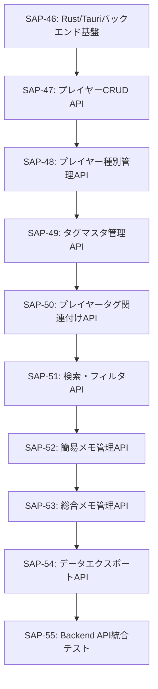

# Phase 2: Backend API

## 📋 フェーズ概要
- **フェーズ名**: Backend API
- **期間**: 12日（96時間）
- **タスク数**: 9タスク
- **開始日**: 2025-10-05（想定）
- **完了予定日**: 2025-10-20（想定）

## 🎯 フェーズ目標
プレイヤーノート機能のすべてのBackend APIを実装し、フロントエンドから利用可能な完全なREST APIを提供する。

## 📋 タスク一覧

### タスク4: プレイヤーCRUD API
- **Linear Issue**: [SAP-47](https://linear.app/sapphire-poker/issue/SAP-47)
- **推定工数**: 12時間
- **タスク種別**: TDD
- **優先度**: 高
- **依存関係**: SAP-46（Rust/Tauriバックエンド基盤）

#### 🎯 目的
プレイヤーの基本的なCRUD（Create, Read, Update, Delete）操作を提供するAPIを実装し、フロントエンドからプレイヤー情報の管理を可能にする。

#### 📝 主要機能
- プレイヤーの作成・取得・更新・削除
- 同名プレイヤー識別機能
- 論理削除による安全な削除
- バリデーション機能

### タスク5: プレイヤー種別管理API
- **Linear Issue**: [SAP-48](https://linear.app/sapphire-poker/issue/SAP-48)
- **推定工数**: 10時間
- **タスク種別**: TDD
- **優先度**: 高
- **依存関係**: SAP-47（プレイヤーCRUD API）

#### 🎯 目的
プレイヤーの強さレベルを分類するための種別システムを実装し、色と名称でカスタマイズ可能な分類機能を提供する。

#### 📝 主要機能
- 種別の作成・取得・更新・削除
- デフォルト種別の自動作成
- 種別統計情報の取得
- 使用中種別の削除制限

### タスク6: タグマスタ管理API
- **Linear Issue**: [SAP-49](https://linear.app/sapphire-poker/issue/SAP-49)
- **推定工数**: 12時間
- **タスク種別**: TDD
- **優先度**: 高
- **依存関係**: SAP-48（プレイヤー種別管理API）

#### 🎯 目的
プレイヤーの特徴を詳細に分類するためのタグシステムを実装し、レベル付きタグとレベルなしタグの両方に対応する。

#### 📝 主要機能
- タグマスタの作成・取得・更新・削除
- レベル付き/レベルなしタグの対応
- ローマ数字表示と色の濃淡機能
- タグレベル表示ヘルパー関数

### タスク7: プレイヤータグ関連付けAPI
- **Linear Issue**: [SAP-50](https://linear.app/sapphire-poker/issue/SAP-50)
- **推定工数**: 10時間
- **タスク種別**: TDD
- **優先度**: 高
- **依存関係**: SAP-49（タグマスタ管理API）

#### 🎯 目的
プレイヤーとタグの多対多関係を管理し、レベル付きタグの関連付け・更新・削除機能を提供する。

#### 📝 主要機能
- プレイヤータグの関連付け・解除
- タグレベルの設定・更新
- プレイヤータグ詳細情報の取得
- 重複関連付けの制御

### タスク8: 検索・フィルタAPI
- **Linear Issue**: [SAP-51](https://linear.app/sapphire-poker/issue/SAP-51)
- **推定工数**: 12時間
- **タスク種別**: TDD
- **優先度**: 中
- **依存関係**: SAP-50（プレイヤータグ関連付けAPI）

#### 🎯 目的
プレイヤー名・識別子による部分一致検索と、種別・タグによるフィルタリング機能を提供する。

#### 📝 主要機能
- 名前・識別子による部分一致検索
- 種別・タグによるフィルタリング
- ページネーション対応
- 検索性能の最適化（500ms以内）

### タスク9: 簡易メモ管理API
- **Linear Issue**: [SAP-52](https://linear.app/sapphire-poker/issue/SAP-52)
- **推定工数**: 10時間
- **タスク種別**: TDD
- **優先度**: 高
- **依存関係**: SAP-51（検索・フィルタAPI）

#### 🎯 目的
プレイヤーごとの簡易メモ機能を実装し、ハンド履歴やプレイスタイルの記録を可能にする。

#### 📝 主要機能
- 簡易メモの作成・取得・更新・削除
- HTML形式でのコンテンツ保存
- プレイヤー別メモ一覧取得
- メモの高速起動（300ms以内）

### タスク10: 総合メモ管理API
- **Linear Issue**: [SAP-53](https://linear.app/sapphire-poker/issue/SAP-53)
- **推定工数**: 8時間
- **タスク種別**: TDD
- **優先度**: 中
- **依存関係**: SAP-52（簡易メモ管理API）

#### 🎯 目的
プレイヤーごとの包括的な分析を記録する総合メモ機能を実装し、自動作成・テンプレート機能を提供する。

#### 📝 主要機能
- 総合メモの自動作成・取得・更新
- デフォルトテンプレートの提供
- HTML形式でのコンテンツ保存
- プレイヤー登録時の自動作成

### タスク11: データエクスポートAPI
- **Linear Issue**: [SAP-54](https://linear.app/sapphire-poker/issue/SAP-54)
- **推定工数**: 8時間
- **タスク種別**: TDD
- **優先度**: 低
- **依存関係**: SAP-53（総合メモ管理API）

#### 🎯 目的
プレイヤーデータの完全なバックアップ・エクスポート機能を実装し、JSON形式でのデータ出力を提供する。

#### 📝 主要機能
- 全データのエクスポート
- 個別プレイヤーデータのエクスポート
- JSON形式での出力
- エクスポートメタデータの付与

### タスク12: Backend API統合テスト
- **Linear Issue**: [SAP-55](https://linear.app/sapphire-poker/issue/SAP-55)
- **推定工数**: 12時間
- **タスク種別**: TDD
- **優先度**: 高
- **依存関係**: SAP-54（データエクスポートAPI）

#### 🎯 目的
Phase 2で実装したすべてのBackend APIの統合テストを実施し、API間の連携・パフォーマンス・データ整合性を検証する。

#### 📝 主要機能
- API連携フローテスト
- パフォーマンステスト
- データ整合性テスト
- 並行処理テスト

## 🔄 タスク依存関係

## ✅ フェーズ完了条件

### 技術的完了条件
- [ ] 全CRUD APIの実装完了
- [ ] タグレベルシステムの実装完了
- [ ] 検索・フィルタ機能の実装完了
- [ ] メモ管理機能の実装完了
- [ ] エクスポート機能の実装完了
- [ ] 統合テストの全通過

### パフォーマンス完了条件
- [ ] 一覧表示性能100ms以内達成
- [ ] 検索性能500ms以内達成
- [ ] メモエディタ起動300ms以内達成
- [ ] 1000件データでの安定動作確認

### 品質完了条件
- [ ] 単体テストカバレッジ80%以上
- [ ] 統合テストの全通過
- [ ] API間データ整合性の確認
- [ ] エラーハンドリングの網羅的な実装

## 🧪 フェーズテスト戦略

### 単体テスト
- 各APIの機能テスト
- バリデーションテスト
- エラーハンドリングテスト
- パフォーマンステスト

### 統合テスト
- API間連携テスト
- データベース制約テスト
- トランザクション整合性テスト
- 並行処理テスト

### エンドツーエンドテスト
- 完全なデータフローテスト
- パフォーマンス要件検証
- ストレステスト

## 📊 フェーズマイルストーン

### マイルストーン M2.1: 基本API完了（Day 8）
- プレイヤー・種別・タグ関連APIの完成
- 基本的なCRUD操作の確認
- 基本的な統合テストの通過

### マイルストーン M2.2: 高度機能完了（Day 12）
- 検索・メモ・エクスポート機能の完成
- 全統合テストの通過
- パフォーマンス要件の達成

## 🔗 関連フェーズ

### 前のフェーズ
- **Phase 1**: Infrastructure & Database（SAP-44〜SAP-46）
  - データベース基盤とTauriバックエンドの構築

### 次のフェーズ
- **Phase 3**: Frontend Components（SAP-56〜SAP-67）
  - UIコンポーネントとReact実装
  - 状態管理システム
  - レスポンシブ対応

## 📝 注意事項

### 実装上の注意
1. **API設計**: RESTful設計原則の遵守
2. **エラーハンドリング**: 一貫したエラーレスポンス形式
3. **パフォーマンス**: 適切なインデックス使用とクエリ最適化
4. **セキュリティ**: 入力値の適切なバリデーション

### テスト実施上の注意
1. **テストデータ**: 本番に近いデータ量でのテスト実施
2. **パフォーマンス**: 継続的なパフォーマンス監視
3. **整合性**: データベース制約の厳密な検証

### Linear統合
- 全タスクはLinear Issueとして管理
- 進捗は定期的にLinearで更新
- ブロッカーや課題はLinear Issueで報告

## 🚀 次ステップ

Phase 2完了後、Phase 3のFrontend Components開発に移行します：
1. TypeScript型定義の作成
2. 基本UIコンポーネントの実装
3. 状態管理システムの構築
4. レスポンシブ対応

Phase 2のAPIがあることで、Phase 3以降のフロントエンド開発を効率的に進めることができます。