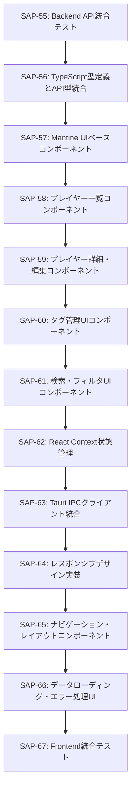

# Phase 3: Frontend Components

## 📋 フェーズ概要
- **フェーズ名**: Frontend Components
- **期間**: 12日（96時間）
- **タスク数**: 12タスク
- **開始日**: 2025-10-21（想定）
- **完了予定日**: 2025-11-05（想定）

## 🎯 フェーズ目標
プレイヤーノート機能のフロントエンド実装を行い、直感的で使いやすいUIコンポーネントとレスポンシブなユーザーインターフェースを提供する。

## 📋 タスク一覧

### タスク13: TypeScript型定義とAPI型統合
- **Linear Issue**: [SAP-56](https://linear.app/sapphire-poker/issue/SAP-56)
- **推定工数**: 8時間
- **タスク種別**: TDD
- **優先度**: 高
- **依存関係**: SAP-55（Backend API統合テスト）

#### 🎯 目的
Rust APIレスポンスに対応するTypeScript型定義を作成し、フロントエンドとバックエンド間の型安全性を確保する。

#### 📝 主要機能
- Player、PlayerType、Tag、Memoエンティティの型定義
- API Request/Response型の定義
- Tauri Command型マッピング
- バリデーション関数の実装

### タスク14: Mantine UIベースコンポーネント
- **Linear Issue**: [SAP-57](https://linear.app/sapphire-poker/issue/SAP-57)
- **推定工数**: 10時間
- **タスク種別**: TDD
- **優先度**: 高
- **依存関係**: SAP-56（TypeScript型定義とAPI型統合）

#### 🎯 目的
Mantine UIライブラリを活用した再利用可能なUIコンポーネントライブラリを構築し、一貫性のあるデザインシステムを提供する。

#### 📝 主要機能
- 共通UIコンポーネント（Button、Modal、Form等）
- カスタムコンポーネント（PlayerCard、TagBadge等）
- テーマ設定とカスタマイズ
- アクセシビリティ対応

### タスク15: プレイヤー一覧コンポーネント
- **Linear Issue**: [SAP-58](https://linear.app/sapphire-poker/issue/SAP-58)
- **推定工数**: 12時間
- **タスク種別**: TDD
- **優先度**: 高
- **依存関係**: SAP-57（Mantine UIベースコンポーネント）

#### 🎯 目的
プレイヤーを効率的に表示・管理するための一覧コンポーネントを実装し、リスト表示とカード表示の切り替え機能を提供する。

#### 📝 主要機能
- リスト表示/カード表示切り替え
- ソート・フィルタ機能
- ページネーション対応
- 仮想スクロール（1000件対応）

### タスク16: プレイヤー詳細・編集コンポーネント
- **Linear Issue**: [SAP-59](https://linear.app/sapphire-poker/issue/SAP-59)
- **推定工数**: 10時間
- **タスク種別**: TDD
- **優先度**: 高
- **依存関係**: SAP-58（プレイヤー一覧コンポーネント）

#### 🎯 目的
プレイヤーの詳細情報表示と編集機能を提供し、直感的な情報管理を可能にする。

#### 📝 主要機能
- プレイヤー詳細情報表示
- インライン編集機能
- バリデーション付きフォーム
- 変更履歴表示

### タスク17: タグ管理UIコンポーネント
- **Linear Issue**: [SAP-60](https://linear.app/sapphire-poker/issue/SAP-60)
- **推定工数**: 10時間
- **タスク種別**: TDD
- **優先度**: 高
- **依存関係**: SAP-59（プレイヤー詳細・編集コンポーネント）

#### 🎯 目的
タグマスタとプレイヤータグの関連付けを管理するUIを実装し、レベル付きタグの視覚的表現を提供する。

#### 📝 主要機能
- タグマスタ管理画面
- レベル付きタグ表示（ローマ数字＋色の濃淡）
- ドラッグ&ドロップによるタグ関連付け
- タグレベル設定UI

### タスク18: 検索・フィルタUIコンポーネント
- **Linear Issue**: [SAP-61](https://linear.app/sapphire-poker/issue/SAP-61)
- **推定工数**: 8時間
- **タスク種別**: TDD
- **優先度**: 中
- **依存関係**: SAP-60（タグ管理UIコンポーネント）

#### 🎯 目的
高速で直感的な検索・フィルタ機能を提供し、効率的なプレイヤー情報検索を可能にする。

#### 📝 主要機能
- リアルタイム検索（部分一致）
- タグ・種別によるフィルタリング
- 検索結果ハイライト
- 検索履歴機能

### タスク19: React Context状態管理
- **Linear Issue**: [SAP-62](https://linear.app/sapphire-poker/issue/SAP-62)
- **推定工数**: 8時間
- **タスク種別**: TDD
- **優先度**: 高
- **依存関係**: SAP-61（検索・フィルタUIコンポーネント）

#### 🎯 目的
React ContextとHooksを使用したグローバル状態管理システムを構築し、コンポーネント間の効率的なデータ共有を実現する。

#### 📝 主要機能
- PlayerContext、TagContext、UIContextの実装
- カスタムHooks（usePlayer、useTag等）
- 状態の永続化機能
- エラー状態管理

### タスク20: Tauri IPCクライアント統合
- **Linear Issue**: [SAP-63](https://linear.app/sapphire-poker/issue/SAP-63)
- **推定工数**: 8時間
- **タスク種別**: TDD
- **優先度**: 高
- **依存関係**: SAP-62（React Context状態管理）

#### 🎯 目的
TauriのIPCシステムを使用してRustバックエンドとの通信を行うクライアントライブラリを実装し、型安全なAPI呼び出しを提供する。

#### 📝 主要機能
- Tauri Command呼び出しラッパー
- 非同期処理とエラーハンドリング
- レスポンス型変換
- 接続状態管理

### タスク21: レスポンシブデザイン実装
- **Linear Issue**: [SAP-64](https://linear.app/sapphire-poker/issue/SAP-64)
- **推定工数**: 6時間
- **タスク種別**: TDD
- **優先度**: 中
- **依存関係**: SAP-63（Tauri IPCクライアント統合）

#### 🎯 目的
モバイルデバイスからデスクトップまで対応するレスポンシブデザインを実装し、どの環境でも快適な操作性を提供する。

#### 📝 主要機能
- モバイルファーストデザイン
- ブレークポイント設計
- タッチ操作対応
- 画面サイズ別最適化

### タスク22: ナビゲーション・レイアウトコンポーネント
- **Linear Issue**: [SAP-65](https://linear.app/sapphire-poker/issue/SAP-65)
- **推定工数**: 6時間
- **タスク種別**: TDD
- **優先度**: 中
- **依存関係**: SAP-64（レスポンシブデザイン実装）

#### 🎯 目的
一貫したナビゲーション体験を提供するメニューとレイアウトシステムを実装し、効率的な画面遷移を実現する。

#### 📝 主要機能
- ヘッダー・サイドバー・フッター
- ナビゲーションメニュー
- パンくずリスト
- ページ遷移アニメーション

### タスク23: データローディング・エラー処理UI
- **Linear Issue**: [SAP-66](https://linear.app/sapphire-poker/issue/SAP-66)
- **推定工数**: 6時間
- **タスク種別**: TDD
- **優先度**: 中
- **依存関係**: SAP-65（ナビゲーション・レイアウトコンポーネント）

#### 🎯 目的
優れたUXを提供するためのローディング状態とエラー処理UIを実装し、ユーザーに適切なフィードバックを提供する。

#### 📝 主要機能
- スケルトンローディング
- プログレスインディケータ
- エラートースト通知
- リトライ機能

### タスク24: Frontend統合テスト
- **Linear Issue**: [SAP-67](https://linear.app/sapphire-poker/issue/SAP-67)
- **推定工数**: 4時間
- **タスク種別**: TDD
- **優先度**: 高
- **依存関係**: SAP-66（データローディング・エラー処理UI）

#### 🎯 目的
Phase 3で実装したすべてのFrontendコンポーネントの統合テストを実施し、コンポーネント間の連携と全体的な動作を検証する。

#### 📝 主要機能
- コンポーネント統合テスト
- 状態管理テスト
- API通信テスト
- レスポンシブ動作テスト

## 🔄 タスク依存関係

## ✅ フェーズ完了条件

### 技術的完了条件
- [ ] 全UIコンポーネントの実装完了
- [ ] TypeScript型安全性の確保
- [ ] レスポンシブデザインの実装完了
- [ ] 状態管理システムの構築完了
- [ ] Tauri IPC通信の実装完了
- [ ] 統合テストの全通過

### パフォーマンス完了条件
- [ ] 初回ページ読み込み2秒以内達成
- [ ] コンポーネント描画100ms以内達成
- [ ] 1000件データでの滑らかなスクロール
- [ ] モバイルでのタッチ応答性確保

### 品質完了条件
- [ ] 単体テストカバレッジ80%以上
- [ ] 統合テストの全通過
- [ ] アクセシビリティWCAG AA準拠
- [ ] 全ブラウザでの動作確認

## 🧪 フェーズテスト戦略

### 単体テスト
- 各コンポーネントの機能テスト
- Hookの動作テスト
- 型定義の検証テスト
- レスポンシブ動作テスト

### 統合テスト
- コンポーネント間連携テスト
- 状態管理フローテスト
- API通信統合テスト
- ナビゲーションテスト

### エンドツーエンドテスト
- ユーザーシナリオテスト
- クロスブラウザテスト
- モバイルデバイステスト
- パフォーマンステスト

## 📊 フェーズマイルストーン

### マイルストーン M3.1: 基本コンポーネント完了（Day 8）
- 型定義・基本UIコンポーネントの完成
- プレイヤー一覧・詳細画面の実装
- 基本的な統合テストの通過

### マイルストーン M3.2: 高度機能完了（Day 12）
- タグ管理・検索機能の完成
- 状態管理・IPC通信の実装
- レスポンシブ対応の完了
- 全統合テストの通過

## 🔗 関連フェーズ

### 前のフェーズ
- **Phase 2**: Backend API（SAP-47〜SAP-55）
  - 全APIエンドポイントの実装完了
  - バックエンド統合テスト通過

### 次のフェーズ
- **Phase 4**: Rich Text Editor（SAP-68〜SAP-70）
  - TipTapエディタの統合
  - リッチテキスト編集機能
  - 自動保存・復元機能

## 📝 注意事項

### 実装上の注意
1. **TypeScript**: 厳密な型定義による型安全性の確保
2. **Mantine**: テーマシステムの適切な活用
3. **パフォーマンス**: 仮想スクロールとメモ化の適切な使用
4. **アクセシビリティ**: ARIA属性とキーボードナビゲーション

### テスト実施上の注意
1. **テストデータ**: 実際のユーザーデータに近い形でのテスト実施
2. **デバイステスト**: 複数のデバイス・画面サイズでの動作確認
3. **パフォーマンス**: 継続的なパフォーマンス監視

### Linear統合
- 全タスクはLinear Issueとして管理
- 進捗は定期的にLinearで更新
- ブロッカーや課題はLinear Issueで報告

## 🚀 次ステップ

Phase 3完了後、Phase 4のRich Text Editor開発に移行します：
1. TipTapエディタの統合
2. リッチテキスト編集機能の実装
3. 自動保存・復元機能の構築
4. エディタUI/UXの最適化

Phase 3のUIコンポーネントがあることで、Phase 4以降のエディタ統合と最終的な品質保証を効率的に進めることができます。