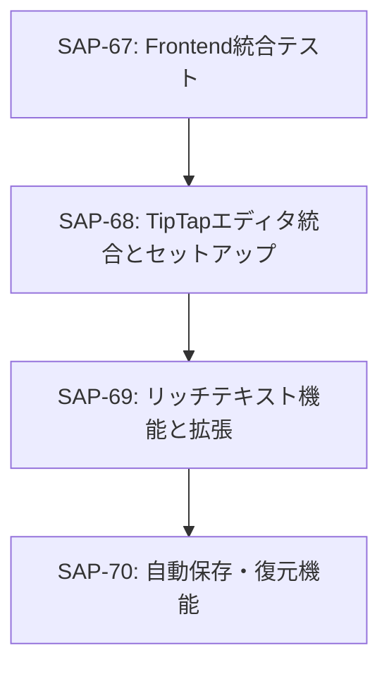

# Phase 4: Rich Text Editor

## 📋 フェーズ概要
- **フェーズ名**: Rich Text Editor
- **期間**: 3日（24時間）
- **タスク数**: 3タスク
- **開始日**: 2025-11-06（想定）
- **完了予定日**: 2025-11-08（想定）

## 🎯 フェーズ目標
TipTapエディタを統合したリッチテキスト編集機能を実装し、プレイヤーのメモ機能に高度なテキスト編集環境を提供する。

## 📋 タスク一覧

### タスク25: TipTapエディタ統合とセットアップ
- **Linear Issue**: [SAP-68](https://linear.app/sapphire-poker/issue/SAP-68)
- **推定工数**: 10時間
- **タスク種別**: DIRECT
- **優先度**: 高
- **依存関係**: SAP-67（Frontend統合テスト）

#### 🎯 目的
TipTapリッチテキストエディタをReactアプリケーションに統合し、基本的な編集機能とUI/UXを構築する。

#### 📝 主要機能
- TipTapエディタのReact統合
- 基本的な編集機能（太字、斜体、リスト等）
- カスタムツールバーの実装
- エディタテーマの設定

#### 📦 成果物
- `src/components/editor/TipTapEditor.tsx`
- `src/components/editor/EditorToolbar.tsx`
- `src/components/editor/EditorStyles.css`
- `src/hooks/useEditor.ts`

### タスク26: リッチテキスト機能と拡張
- **Linear Issue**: [SAP-69](https://linear.app/sapphire-poker/issue/SAP-69)
- **推定工数**: 8時間
- **タスク種別**: TDD
- **優先度**: 高
- **依存関係**: SAP-68（TipTapエディタ統合とセットアップ）

#### 🎯 目的
プレイヤーメモに特化したリッチテキスト機能を実装し、ポーカー分析に適した編集ツールを提供する。

#### 📝 主要機能
- ポーカー専用記号・絵文字の挿入
- テーブル作成機能（ハンド履歴記録用）
- カラーハイライト機能
- 箇条書き・番号付きリスト

#### 📦 成果物
- `src/components/editor/PokerExtensions.ts`
- `src/components/editor/TableExtension.ts`
- `src/components/editor/HighlightExtension.ts`
- `src/components/editor/PokerSymbols.tsx`

### タスク27: 自動保存・復元機能
- **Linear Issue**: [SAP-70](https://linear.app/sapphire-poker/issue/SAP-70)
- **推定工数**: 6時間
- **タスク種別**: TDD
- **優先度**: 高
- **依存関係**: SAP-69（リッチテキスト機能と拡張）

#### 🎯 目的
エディタ内容の自動保存・復元機能を実装し、データ損失を防ぎつつ快適な編集体験を提供する。

#### 📝 主要機能
- リアルタイム自動保存（3秒間隔）
- 編集履歴の管理
- セッション復元機能
- 競合解決機能

#### 📦 成果物
- `src/hooks/useAutoSave.ts`
- `src/services/EditorStorage.ts`
- `src/components/editor/AutoSaveIndicator.tsx`
- `src/utils/conflictResolution.ts`

## 🔄 タスク依存関係

## ✅ フェーズ完了条件

### 技術的完了条件
- [ ] TipTapエディタの完全な統合
- [ ] ポーカー専用機能の実装完了
- [ ] 自動保存機能の動作確認
- [ ] エディタUIの最適化完了
- [ ] 全単体テスト・統合テストの通過

### パフォーマンス完了条件
- [ ] エディタ起動時間300ms以内達成
- [ ] 自動保存処理100ms以内達成
- [ ] 大容量テキスト（10KB）でのスムーズな編集
- [ ] メモリ使用量の最適化

### 品質完了条件
- [ ] 単体テストカバレッジ80%以上
- [ ] エディタ機能テストの全通過
- [ ] データ整合性の確認
- [ ] UX/UIの品質確認

## 🧪 フェーズテスト戦略

### 単体テスト
- エディタコンポーネントの機能テスト
- 自動保存ロジックのテスト
- 拡張機能の動作テスト
- エラーハンドリングテスト

### 統合テスト
- エディタ〜バックエンド間通信テスト
- 自動保存〜データベース整合性テスト
- 複数エディタインスタンステスト
- セッション復元テスト

### エンドツーエンドテスト
- 完全な編集フローテスト
- データ損失防止テスト
- パフォーマンステスト
- ユーザビリティテスト

## 📊 フェーズマイルストーン

### マイルストーン M4.1: エディタ基盤完了（Day 2）
- TipTapエディタの統合完了
- 基本的な編集機能の実装
- エディタUIの構築完了

### マイルストーン M4.2: 高度機能完了（Day 3）
- ポーカー専用機能の完成
- 自動保存機能の実装完了
- 全テストの通過確認

## 🔗 関連フェーズ

### 前のフェーズ
- **Phase 3**: Frontend Components（SAP-56〜SAP-67）
  - UIコンポーネントライブラリの完成
  - 状態管理システムの構築
  - レスポンシブデザインの実装

### 次のフェーズ
- **Phase 5**: Integration & Optimization（SAP-71〜SAP-78）
  - エンドツーエンドテストの実施
  - パフォーマンス最適化
  - 最終品質保証

## 📝 注意事項

### 実装上の注意
1. **TipTap設定**: 適切なエクステンションの選択と設定
2. **自動保存**: 過度な保存によるパフォーマンス低下の回避
3. **データ形式**: HTMLからJSONへの変換処理の最適化
4. **UX**: 直感的なツールバーとショートカットキー

### テスト実施上の注意
1. **テストデータ**: 実際のメモ作成シナリオでのテスト実施
2. **パフォーマンス**: 大容量テキストでの動作確認
3. **データ整合性**: 自動保存時のデータ損失防止確認

### Linear統合
- 全タスクはLinear Issueとして管理
- 進捗は定期的にLinearで更新
- ブロッカーや課題はLinear Issueで報告

## 🚀 次ステップ

Phase 4完了後、Phase 5のIntegration & Optimization開発に移行します：
1. エンドツーエンドテストの実施
2. パフォーマンス最適化の実行
3. アクセシビリティ対応の完了
4. 最終品質保証の実施

Phase 4のリッチテキストエディタがあることで、Phase 5でのエンドツーエンド統合テストと最終的なプロダクション品質の確保を効率的に進めることができます。