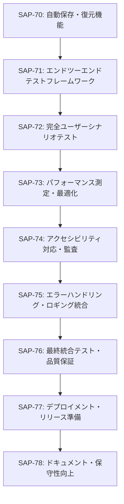

# Phase 5: Integration & Optimization

## 📋 フェーズ概要
- **フェーズ名**: Integration & Optimization
- **期間**: 9日（72時間）
- **タスク数**: 8タスク
- **開始日**: 2025-11-09（想定）
- **完了予定日**: 2025-11-19（想定）

## 🎯 フェーズ目標
プレイヤーノート機能の統合テスト・パフォーマンス最適化・品質保証を実施し、プロダクション環境で安定動作する完成品を提供する。

## 📋 タスク一覧

### タスク28: エンドツーエンドテストフレームワーク
- **Linear Issue**: [SAP-71](https://linear.app/sapphire-poker/issue/SAP-71)
- **推定工数**: 10時間
- **タスク種別**: TDD
- **優先度**: 高
- **依存関係**: SAP-70（自動保存・復元機能）

#### 🎯 目的
WebdriverIOを使用した包括的なE2Eテストフレームワークを構築し、実際のユーザーシナリオに基づく自動テストを実現する。

#### 📝 主要機能
- WebdriverIO環境のセットアップ
- Tauriアプリケーション用テスト設定
- テストデータ管理システム
- テストレポート生成機能

#### 📦 成果物
- `tests/e2e/wdio.conf.ts`
- `tests/e2e/helpers/testData.ts`
- `tests/e2e/helpers/tauriHelper.ts`
- `tests/e2e/specs/基本機能テスト.e2e.ts`

### タスク29: 完全ユーザーシナリオテスト
- **Linear Issue**: [SAP-72](https://linear.app/sapphire-poker/issue/SAP-72)
- **推定工数**: 12時間
- **タスク種別**: TDD
- **優先度**: 高
- **依存関係**: SAP-71（エンドツーエンドテストフレームワーク）

#### 🎯 目的
ユーザストーリーに基づいた完全なワークフローをE2Eテストで自動化し、全機能の連携動作を検証する。

#### 📝 主要機能
- プレイヤー登録から分析までの完全フロー
- タグ・種別管理の統合テスト
- メモ作成・編集・保存の統合テスト
- 検索・フィルタ機能の統合テスト

#### 📦 成果物
- `tests/e2e/specs/プレイヤー管理フロー.e2e.ts`
- `tests/e2e/specs/タグ管理フロー.e2e.ts`
- `tests/e2e/specs/メモ管理フロー.e2e.ts`
- `tests/e2e/specs/検索フィルタフロー.e2e.ts`

### タスク30: パフォーマンス測定・最適化
- **Linear Issue**: [SAP-73](https://linear.app/sapphire-poker/issue/SAP-73)
- **推定工数**: 10時間
- **タスク種別**: TDD
- **優先度**: 高
- **依存関係**: SAP-72（完全ユーザーシナリオテスト）

#### 🎯 目的
性能要件を満たすためのパフォーマンス測定と最適化を実施し、1000件データでの快適な動作を保証する。

#### 📝 主要機能
- 一覧表示性能の最適化（100ms以内）
- 検索性能の最適化（500ms以内）
- メモリ使用量の最適化
- バンドルサイズの最適化

#### 📦 成果物
- `tests/performance/loadTest.ts`
- `tests/performance/memoryTest.ts`
- `src/utils/performance.ts`
- `webpack.config.prod.js`（最適化設定）

### タスク31: アクセシビリティ対応・監査
- **Linear Issue**: [SAP-74](https://linear.app/sapphire-poker/issue/SAP-74)
- **推定工数**: 8時間
- **タスク種別**: TDD
- **優先度**: 中
- **依存関係**: SAP-73（パフォーマンス測定・最適化）

#### 🎯 目的
WCAG AA準拠のアクセシビリティ対応を実施し、すべてのユーザーが利用可能なアプリケーションを構築する。

#### 📝 主要機能
- ARIA属性の適切な実装
- キーボードナビゲーション対応
- スクリーンリーダー対応
- コントラスト比の最適化

#### 📦 成果物
- `src/utils/accessibility.ts`
- `tests/a11y/accessibilityTest.ts`
- `docs/accessibility-guide.md`
- アクセシビリティ監査レポート

### タスク32: エラーハンドリング・ロギング統合
- **Linear Issue**: [SAP-75](https://linear.app/sapphire-poker/issue/SAP-75)
- **推定工数**: 6時間
- **タスク種別**: TDD
- **優先度**: 高
- **依存関係**: SAP-74（アクセシビリティ対応・監査）

#### 🎯 目的
包括的なエラーハンドリングとロギングシステムを実装し、プロダクション環境での問題診断を容易にする。

#### 📝 主要機能
- グローバルエラーハンドリング
- 構造化ログ出力
- エラー報告機能
- デバッグモード対応

#### 📦 成果物
- `src/utils/errorHandler.ts`
- `src/utils/logger.ts`
- `src/components/common/ErrorBoundary.tsx`
- `src/services/errorReporting.ts`

### タスク33: 最終統合テスト・品質保証
- **Linear Issue**: [SAP-76](https://linear.app/sapphire-poker/issue/SAP-76)
- **推定工数**: 10時間
- **タスク種別**: TDD
- **優先度**: 高
- **依存関係**: SAP-75（エラーハンドリング・ロギング統合）

#### 🎯 目的
全機能の最終統合テストを実施し、プロダクション品質を保証する包括的な品質保証を行う。

#### 📝 主要機能
- 全機能統合テスト
- ストレステスト
- セキュリティテスト
- プロダクション環境テスト

#### 📦 成果物
- `tests/integration/fullSystemTest.ts`
- `tests/stress/stressTest.ts`
- `tests/security/securityTest.ts`
- 品質保証レポート

### タスク34: デプロイメント・リリース準備
- **Linear Issue**: [SAP-77](https://linear.app/sapphire-poker/issue/SAP-77)
- **推定工数**: 8時間
- **タスク種別**: DIRECT
- **優先度**: 高
- **依存関係**: SAP-76（最終統合テスト・品質保証）

#### 🎯 目的
プロダクション環境へのデプロイメント準備とリリースプロセスを整備し、安全で確実なリリースを実現する。

#### 📝 主要機能
- ビルド設定の最適化
- インストーラー作成
- 自動更新機能
- リリースノート作成

#### 📦 成果物
- `scripts/build-prod.sh`
- `tauri.conf.json`（プロダクション設定）
- `installer/`（インストーラーファイル）
- `RELEASE_NOTES.md`

### タスク35: ドキュメント・保守性向上
- **Linear Issue**: [SAP-78](https://linear.app/sapphire-poker/issue/SAP-78)
- **推定工数**: 8時間
- **タスク種別**: DIRECT
- **優先度**: 中
- **依存関係**: SAP-77（デプロイメント・リリース準備）

#### 🎯 目的
技術ドキュメント・ユーザードキュメントを整備し、長期的な保守性とユーザビリティを向上させる。

#### 📝 主要機能
- API仕様書の作成
- ユーザーマニュアルの作成
- 開発者向けドキュメント
- トラブルシューティングガイド

#### 📦 成果物
- `docs/api/API仕様書.md`
- `docs/user/ユーザーマニュアル.md`
- `docs/dev/開発者ガイド.md`
- `docs/troubleshooting.md`

## 🔄 タスク依存関係

## ✅ フェーズ完了条件

### 技術的完了条件
- [ ] 全E2Eテストの通過
- [ ] パフォーマンス要件の達成
- [ ] アクセシビリティWCAG AA準拠
- [ ] エラーハンドリングの完全実装
- [ ] 最終統合テストの全通過
- [ ] プロダクションビルドの正常作成

### パフォーマンス完了条件
- [ ] 一覧表示性能100ms以内達成
- [ ] 検索性能500ms以内達成
- [ ] エディタ起動性能300ms以内達成
- [ ] 1000件データでの安定動作確認
- [ ] メモリ使用量最適化完了

### 品質完了条件
- [ ] E2Eテストカバレッジ90%以上
- [ ] 全機能の統合テスト通過
- [ ] セキュリティテストの通過
- [ ] プロダクション品質基準の達成

## 🧪 フェーズテスト戦略

### エンドツーエンドテスト
- 完全なユーザーシナリオテスト
- クロスプラットフォームテスト
- パフォーマンステスト
- セキュリティテスト

### 統合テスト
- システム全体の統合テスト
- API〜フロントエンド統合テスト
- データベース〜アプリケーション統合テスト
- エラーフロー統合テスト

### 品質保証テスト
- ユーザビリティテスト
- アクセシビリティテスト
- ストレステスト
- プロダクション環境テスト

## 📊 フェーズマイルストーン

### マイルストーン M5.1: テスト基盤完了（Day 4）
- E2Eテストフレームワークの構築完了
- 全ユーザーシナリオテストの実装
- 基本的な統合テストの通過

### マイルストーン M5.2: 最適化完了（Day 7）
- パフォーマンス最適化の完了
- アクセシビリティ対応の完了
- エラーハンドリング実装の完了

### マイルストーン M5.3: リリース準備完了（Day 9）
- 最終統合テストの通過
- プロダクションビルドの完成
- ドキュメント整備の完了

## 🔗 関連フェーズ

### 前のフェーズ
- **Phase 4**: Rich Text Editor（SAP-68〜SAP-70）
  - TipTapエディタの統合完了
  - リッチテキスト機能の実装
  - 自動保存機能の構築

### 次のフェーズ
- なし（最終フェーズ）

## 📝 注意事項

### 実装上の注意
1. **テスト環境**: 本番に近い環境でのテスト実施
2. **パフォーマンス**: 継続的な監視と最適化
3. **セキュリティ**: 包括的なセキュリティテストの実施
4. **ドキュメント**: 長期保守を考慮した詳細な記録

### テスト実施上の注意
1. **テストデータ**: 実際の利用パターンに基づくテストデータ
2. **環境**: 複数のOS・デバイスでの動作確認
3. **パフォーマンス**: 様々なデータ量での性能測定
4. **ユーザビリティ**: 実際のユーザーによる使用感テスト

### Linear統合
- 全タスクはLinear Issueとして管理
- 進捗は定期的にLinearで更新
- ブロッカーや課題はLinear Issueで報告

## 🚀 プロジェクト完了

Phase 5の完了により、プレイヤーノート機能の開発が完全に終了します：

### 達成される成果
1. **完全なプレイヤーノート機能**
   - プレイヤー管理・分析機能
   - タグ・種別システム
   - リッチテキストメモ機能
   - 検索・フィルタ機能

2. **高品質なプロダクション**
   - パフォーマンス要件の達成
   - アクセシビリティ対応
   - 包括的なテストカバレッジ
   - 完全なドキュメント

3. **継続的保守性**
   - 構造化されたコードベース
   - 包括的なテストスイート
   - 詳細な技術ドキュメント
   - エラーハンドリング・ロギング

プレイヤーノート機能は、ポーカープレイヤーにとって必須のツールとして、長期間にわたって安定した価値を提供することができます。