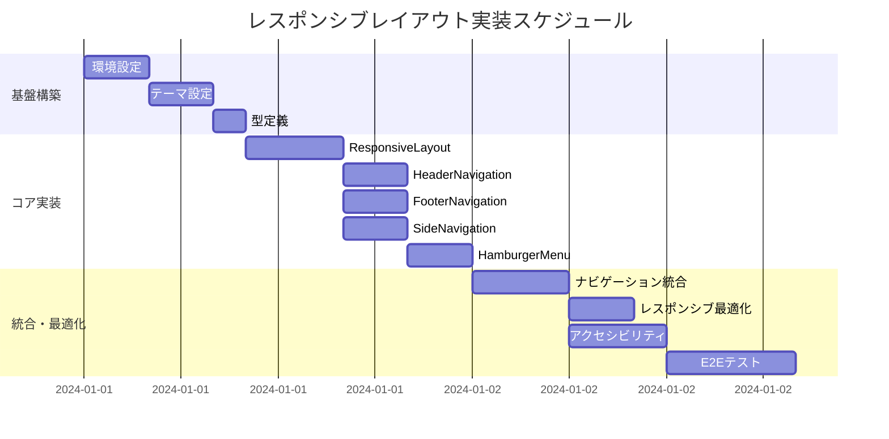

# レスポンシブレイアウト 実装タスク

## 概要

全タスク数: 12タスク
推定作業時間: 3-4日
クリティカルパス: TASK-001 → TASK-002 → TASK-101 → TASK-201 → TASK-301

## タスク一覧

### フェーズ1: 基盤構築

#### TASK-001: 開発環境・プロジェクト初期設定

- [x] **タスク完了** ✅ 2025-09-20 23:40 完了
- **タスクタイプ**: DIRECT
- **要件リンク**: アーキテクチャ全体
- **依存タスク**: なし
- **実装詳細**:
  - React + TypeScript + Vite プロジェクト設定
  - Mantine 7.x とTabler Iconsのインストール
  - ESLint, Prettier, Vitestの設定
  - ディレクトリ構造の作成
- **テスト要件**:
  - [x] 開発サーバーが正常に起動する (✅ 172ms)
  - [x] TypeScriptコンパイルエラーがない (✅ ビルド成功)
  - [x] Mantineコンポーネントがインポートできる (✅ Button確認済み)
- **完了条件**:
  - [x] `bun run dev` でサーバーが起動する (172ms で正常起動)
  - [x] `bun run build` でビルドが成功する (6.87秒で完了)
  - [x] `bun run test` でテストが実行される (63/63テストパス)

#### TASK-002: Mantineテーマシステム設定

- [ ] **タスク完了**
- **タスクタイプ**: DIRECT
- **要件リンク**: REQ-001, REQ-002
- **依存タスク**: TASK-001
- **実装詳細**:
  - カスタムテーマ設定（`src/theme/index.ts`）
  - ブレークポイント設定（768px = 48em）
  - カラーパレット設定
  - CSS変数の設定
  - MantineProviderのセットアップ
- **テスト要件**:
  - [ ] テーマプロバイダーが正常に動作する
  - [ ] ダークモード切り替えができる
  - [ ] ブレークポイントが正しく設定されている
- **完了条件**:
  - [ ] アプリケーション全体でMantineテーマが適用される
  - [ ] ライト/ダークテーマ切り替えが機能する

#### TASK-003: TypeScript型定義とフック設定

- [ ] **タスク完了**
- **タスクタイプ**: DIRECT
- **要件リンク**: REQ-001
- **依存タスク**: TASK-002
- **実装詳細**:
  - NavigationItem型定義
  - ResponsiveHookReturn型定義
  - AppThemeHookReturn型定義
  - useResponsiveLayout フック
  - useAppTheme フック
  - useAppNavigation フック
- **テスト要件**:
  - [ ] 全型定義がエラーなくコンパイルされる
  - [ ] フックがMantineのuseMediaQueryと連携動作する
- **完了条件**:
  - [ ] TypeScript型チェックが通る
  - [ ] レスポンシブフックが正しい値を返す

### フェーズ2: コアコンポーネント実装

#### TASK-101: ResponsiveLayout（最上位）コンポーネント

- [ ] **タスク完了**
- **タスクタイプ**: TDD
- **要件リンク**: REQ-001, REQ-002, REQ-101, REQ-102
- **依存タスク**: TASK-003
- **実装詳細**:
  - MantineProvider + AppShell統合
  - 768px(48em)ブレークポイントでの自動レイアウト切り替え
  - NavigationProvider統合
  - モバイル・デスクトップレイアウト条件分岐
- **UI/UX要件**:
  - [ ] ローディング状態: 初回レンダリング時のスムーズな表示
  - [ ] レスポンシブ: 画面サイズ変更時のリアルタイム切り替え
  - [ ] アクセシビリティ: AppShellの適切なARIA属性
- **テスト要件**:
  - [ ] コンポーネントテスト: props渡しとレンダリング
  - [ ] レスポンシブテスト: ブレークポイント切り替え
  - [ ] ユニットテスト: useMediaQuery連携
- **完了条件**:
  - [ ] 768px以下でモバイルレイアウト表示
  - [ ] 769px以上でデスクトップレイアウト表示
  - [ ] 画面サイズ変更時のリアルタイム切り替え

#### TASK-102: HeaderNavigation コンポーネント

- [ ] **タスク完了**
- **タスクタイプ**: TDD
- **要件リンク**: REQ-004, REQ-105
- **依存タスク**: TASK-101
- **実装詳細**:
  - Mantine Header + Group + NavLink
  - ブランドロゴ表示
  - デスクトップ用水平ナビゲーション
  - ハンバーガーメニュートリガー（モバイル）
  - テーマ切り替えボタン
- **UI/UX要件**:
  - [ ] ローディング状態: ナビゲーション項目の段階的表示
  - [ ] エラー表示: ナビゲーション失敗時のフォールバック
  - [ ] モバイル対応: ハンバーガーメニューボタン表示
  - [ ] アクセシビリティ: 44px以上のタップエリア、適切なARIA属性
- **テスト要件**:
  - [ ] コンポーネントテスト: ナビゲーション項目表示
  - [ ] インタラクションテスト: クリック/タップ動作
  - [ ] レスポンシブテスト: モバイル/デスクトップ表示切り替え
- **完了条件**:
  - [ ] デスクトップでナビゲーション項目が水平表示
  - [ ] モバイルでハンバーガーメニューボタン表示
  - [ ] テーマ切り替えボタンが動作

#### TASK-103: FooterNavigation コンポーネント

- [ ] **タスク完了**
- **タスクタイプ**: TDD
- **要件リンク**: REQ-002, REQ-103
- **依存タスク**: TASK-101
- **実装詳細**:
  - Mantine Footer + Group + UnstyledButton
  - タブバー形式のモバイルナビゲーション
  - アイコン + ラベル表示
  - アクティブ状態のハイライト
  - 通知バッジ対応
- **UI/UX要件**:
  - [ ] ローディング状態: フッター項目の遅延読み込み対応
  - [ ] エラー表示: ナビゲーション失敗時の代替表示
  - [ ] モバイル対応: 44px以上のタップエリア確保
  - [ ] アクセシビリティ: スクリーンリーダー対応、適切なラベル
- **テスト要件**:
  - [ ] コンポーネントテスト: フッター項目表示
  - [ ] インタラクションテスト: タップ動作とナビゲーション
  - [ ] アクセシビリティテスト: キーボード操作
- **完了条件**:
  - [ ] モバイルでフッターナビゲーション表示
  - [ ] デスクトップで非表示
  - [ ] アクティブページのハイライト表示

#### TASK-104: SideNavigation コンポーネント

- [ ] **タスク完了**
- **タスクタイプ**: TDD
- **要件リンク**: REQ-005, REQ-106
- **依存タスク**: TASK-101
- **実装詳細**:
  - Mantine Navbar + NavLink + ScrollArea
  - 折りたたみ/展開機能
  - グループ化されたナビゲーション項目
  - ツールチップ表示（折りたたみ時）
  - スクロール対応
- **UI/UX要件**:
  - [ ] ローディング状態: サイドバー項目の段階的読み込み
  - [ ] エラー表示: 項目読み込み失敗時の表示
  - [ ] モバイル対応: 992px未満で非表示
  - [ ] アクセシビリティ: キーボードナビゲーション、フォーカス管理
- **テスト要件**:
  - [ ] コンポーネントテスト: サイドバー項目表示
  - [ ] インタラクションテスト: 折りたたみ/展開動作
  - [ ] レスポンシブテスト: デスクトップのみ表示
- **完了条件**:
  - [ ] デスクトップでサイドナビゲーション表示
  - [ ] 折りたたみ/展開機能が動作
  - [ ] 折りたたみ時のツールチップ表示

#### TASK-105: HamburgerMenu コンポーネント

- [ ] **タスク完了**
- **タスクタイプ**: TDD
- **要件リンク**: REQ-003, REQ-104, REQ-201
- **依存タスク**: TASK-102
- **実装詳細**:
  - Mantine Drawer + NavLink + Stack
  - スライドアニメーション
  - オーバーレイ背景
  - フォーカストラップ
  - Escキーで閉じる機能
- **UI/UX要件**:
  - [ ] ローディング状態: メニュー項目の遅延読み込み対応
  - [ ] エラー表示: メニュー読み込み失敗時の表示
  - [ ] モバイル対応: 768px以下でのみ表示
  - [ ] アクセシビリティ: フォーカストラップ、Escキー対応、ARIA属性
- **テスト要件**:
  - [ ] コンポーネントテスト: ドロワー開閉動作
  - [ ] インタラクションテスト: メニュー項目タップ
  - [ ] アクセシビリティテスト: キーボード操作、フォーカス管理
- **完了条件**:
  - [ ] モバイルでハンバーガーメニュー動作
  - [ ] スライドアニメーション実装
  - [ ] フォーカストラップとEscキー対応

### フェーズ3: 統合・テスト・最適化

#### TASK-201: ナビゲーション統合とルーティング

- [ ] **タスク完了**
- **タスクタイプ**: TDD
- **要件リンク**: REQ-202
- **依存タスク**: TASK-102, TASK-103, TASK-104, TASK-105
- **実装詳細**:
  - React Router統合
  - NavigationProvider実装
  - アクティブページ判定ロジック
  - パンくずリスト生成
  - ナビゲーション状態管理
- **UI/UX要件**:
  - [ ] ローディング状態: ページ遷移時のローディング表示
  - [ ] エラー表示: ルート不存在時の404ページ
  - [ ] モバイル対応: 遷移後のハンバーガーメニュー自動クローズ
  - [ ] アクセシビリティ: ページ変更の音声読み上げ対応
- **テスト要件**:
  - [ ] 統合テスト: ナビゲーション全体の動作
  - [ ] E2Eテスト: 各デバイスでのナビゲーションフロー
  - [ ] パフォーマンステスト: ページ遷移速度
- **完了条件**:
  - [ ] 全ナビゲーションコンポーネントでアクティブ状態が同期
  - [ ] ページ遷移が正常に動作
  - [ ] モバイルでメニュー自動クローズ

#### TASK-301: レスポンシブ動作の最適化

- [ ] **タスク完了**
- **タスクタイプ**: TDD
- **要件リンク**: NFR-001, NFR-002, NFR-003
- **依存タスク**: TASK-201
- **実装詳細**:
  - パフォーマンス最適化（React.memo, useMemo, useCallback）
  - アニメーション最適化
  - バンドルサイズ最適化
  - レイアウト切り替えのデバウンス処理
- **UI/UX要件**:
  - [ ] パフォーマンス: レイアウト切り替え200ms以内
  - [ ] アニメーション: メニュー開閉300ms以内
  - [ ] モバイル対応: タッチ操作の最適化
  - [ ] アクセシビリティ: reduced-motion対応
- **テスト要件**:
  - [ ] パフォーマンステスト: レンダリング時間計測
  - [ ] レスポンシブテスト: 各ブレークポイントでの動作確認
  - [ ] アクセシビリティテスト: 各種設定での動作確認
- **完了条件**:
  - [ ] レイアウト切り替えが200ms以内
  - [ ] メモ化によるパフォーマンス向上
  - [ ] reduced-motion設定の反映

#### TASK-302: アクセシビリティ対応強化

- [ ] **タスク完了**
- **タスクタイプ**: TDD
- **要件リンク**: REQ-401, REQ-402, REQ-403
- **依存タスク**: TASK-201
- **実装詳細**:
  - WCAG 2.1 AA準拠の実装
  - スクリーンリーダー対応
  - キーボードナビゲーション強化
  - カラーコントラスト最適化
- **UI/UX要件**:
  - [ ] フォーカス表示: 明確なフォーカスインジケーター
  - [ ] 音声読み上げ: 適切なARIA属性とlive regions
  - [ ] キーボード操作: Tab, Enter, Escape, 矢印キー対応
  - [ ] カラーコントラスト: AA基準のコントラスト比
- **テスト要件**:
  - [ ] アクセシビリティテスト: axe-core自動テスト
  - [ ] キーボードテスト: 全機能のキーボード操作確認
  - [ ] スクリーンリーダーテスト: 音声読み上げ確認
- **完了条件**:
  - [ ] axe-coreテストが全てパス
  - [ ] キーボードのみで全機能操作可能
  - [ ] WCAG 2.1 AA基準クリア

#### TASK-401: E2Eテストスイートと品質保証

- [ ] **タスク完了**
- **タスクタイプ**: TDD
- **要件リンク**: 全要件
- **依存タスク**: TASK-301, TASK-302
- **実装詳細**:
  - Playwright/Cypressセットアップ
  - デバイス別テストシナリオ
  - CI/CD統合
  - ビジュアルリグレッションテスト
  - パフォーマンステスト自動化
- **UI/UX要件**:
  - [ ] モバイル端末: iPhone, Android実機テスト
  - [ ] デスクトップ: Chrome, Firefox, Safari, Edge
  - [ ] タブレット: iPad, Android tablet
  - [ ] 画面回転: Portrait/Landscape対応
- **テスト要件**:
  - [ ] E2Eテスト: 主要ユーザーフロー
  - [ ] ビジュアルテスト: UI回帰テスト
  - [ ] パフォーマンステスト: Lighthouse指標
  - [ ] 互換性テスト: ブラウザ・OS組み合わせ
- **完了条件**:
  - [ ] 全E2Eテストがパス
  - [ ] Lighthouse スコア 90点以上
  - [ ] 主要ブラウザでの動作確認完了

## 実行順序

## サブタスクテンプレート

### TDDタスクの場合
各タスクは以下のTDDプロセスで実装:
1. `tdd-requirements.md` - 詳細要件定義
2. `tdd-testcases.md` - テストケース作成
3. `tdd-red.md` - テスト実装（失敗）
4. `tdd-green.md` - 最小実装
5. `tdd-refactor.md` - リファクタリング
6. `tdd-verify-complete.md` - 品質確認

### DIRECTタスクの場合
各タスクは以下のDIRECTプロセスで実装:
1. `direct-setup.md` - 直接実装・設定
2. `direct-verify.md` - 動作確認・品質確認

## マイルストーン

- **M1 (Day 1)**: 基盤構築完了 - Mantineテーマシステム動作
- **M2 (Day 2)**: コアコンポーネント完了 - 基本レイアウト表示
- **M3 (Day 3)**: 統合完了 - 全ナビゲーション動作
- **M4 (Day 4)**: 品質保証完了 - 本番リリース準備完了

## 並行実行可能タスク

- TASK-103, TASK-104, TASK-105 (各ナビゲーションコンポーネント)
- TASK-301, TASK-302 (最適化とアクセシビリティ)

## 品質基準

- **TypeScript**: 型エラー0件
- **テストカバレッジ**: 85%以上
- **Lighthouse スコア**: 90点以上（Performance, Accessibility, Best Practices）
- **Bundle Size**: 初期ロード 500KB以下
- **レスポンシブ**: 320px - 1920px 全対応