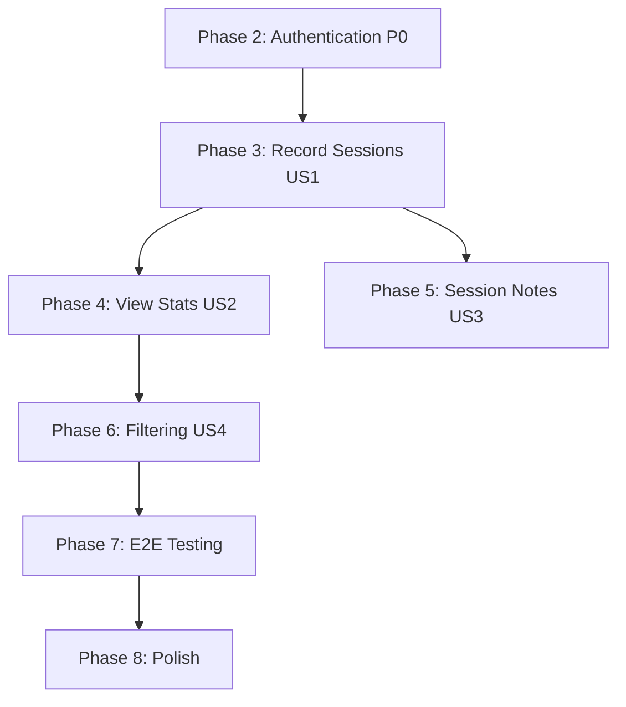

# Implementation Tasks: Poker Session Tracker

**Feature**: 002-poker-session-tracker
**Branch**: `002-poker-session-tracker`
**Created**: 2025-10-21
**Strategy**: Test-Driven Development (TDD) with Red-Green-Refactor cycles

## Overview

This document provides a complete, dependency-ordered task list for implementing the poker session tracker application. All tasks follow TDD principles: tests are written first (Red), implementation makes tests pass (Green), then refactoring improves code quality (Refactor).

**Total Tasks**: 120
**User Stories**: 5 (P0-P4)
**Testing Approach**: Contract tests → Integration tests → E2E tests for each story

## Task Organization

Tasks are organized by user story priority to enable independent, incremental delivery:

1. **Phase 1**: Setup (T001-T003) - Project initialization
2. **Phase 1.5**: Template Cleanup (T004-T008) - Remove sample code
3. **Phase 2**: Foundational (T009-T013) - Authentication infrastructure (P0)
4. **Phase 3**: User Story 1 - Record Sessions (T014-T038) - MVP
5. **Phase 4**: User Story 2 - View History & Statistics (T039-T055)
6. **Phase 5**: User Story 3 - Session Notes (T056-T070)
7. **Phase 6**: User Story 4 - Filtering (T071-T092)
8. **Phase 7**: E2E Testing (T093-T098) - Cross-story validation
9. **Phase 8**: Polish & Validation (T099-T120) - Final quality checks

**[P] marker**: Tasks that can be executed in parallel (no dependencies on incomplete tasks)

---

## Phase 1: Setup (T001-T003)

**Goal**: Initialize project structure and dependencies

### Tasks

- [X] T001 [P] Verify environment setup (Bun v1.0+, PostgreSQL 16, Docker Compose running)
- [X] T002 [P] Install Mantine Dates package in package.json: `bun add @mantine/dates dayjs`
- [X] T003 Run database migrations to apply NextAuth.js schema: `bun run db:push:all`

---

## Phase 1.5: Template Cleanup (T004-T008)

**Goal**: Remove template sample code and make this a poker-only application

**Why**: The original request was to "replace the template" with a poker app, not add to it. This phase removes the sample task management features.

### Tasks

- [X] T004 [P] Delete existing tasks router file: src/server/api/routers/tasks.ts
- [X] T005 [P] Delete existing tasks feature directory: src/features/tasks/ (recursively)
- [X] T006 Update src/server/api/root.ts to remove tasks router import and export
- [X] T007 [P] Rewrite src/app/page.tsx as poker app landing page (welcome message, sign in buttons, app description in Japanese)
- [X] T008 [P] Delete tests for tasks feature: tests/contract/tasks.contract.test.ts

---

## Phase 2: Foundational (T009-T013) - CRITICAL BLOCKER

**Goal**: Implement OAuth2 authentication (User Story 0 - P0)

**Independent Test**: User can sign in with Google/GitHub, log out, log back in, and access only their own data.

**⚠️ BLOCKER**: All subsequent user stories require authentication. This phase must complete before proceeding.

### Tasks

- [X] T009 Add Google and GitHub OAuth environment variables to src/env.js
- [X] T010 [P] Import Google and GitHub providers in src/server/auth/config.ts
- [X] T011 [P] Update NextAuth.js config to include Google and GitHub providers (using NextAuth.js v5 auto-inference)
- [ ] T012 [P] Create E2E test for OAuth sign-in flow in tests/e2e/auth.spec.ts (deferred to Phase 7)
- [X] T013 Verify authentication flow works (manual test: sign in with Google, sign in with GitHub, log out) ✅ VERIFIED

---

## Phase 3: User Story 1 - Record Basic Session Results (T014-T038) - MVP

**Story**: US1 - A logged-in poker player wants to record session details (date, location, buy-in, cash-out, duration) and see only their own sessions.

**Independent Test**: Log in, create a session, view session list, verify session appears with correct data and calculated profit.

**Why MVP**: This is the minimum functionality that delivers value. Users can track their poker performance.

### Database Schema (T014-T016)

- [ ] T014 [P] [US1] Define poker_session table schema in src/server/db/schema.ts with Drizzle ORM
- [ ] T015 [P] [US1] Define poker_session relations in src/server/db/schema.ts (link to users table)
- [ ] T016 [US1] Run database migration: `bun run db:push:all` to create poker_session table

### Utilities (T017)

- [ ] T017 [P] [US1] Create currency formatting utility in src/lib/utils/currency.ts (formatCurrency function for JPY)

### Backend - Contract Tests (T018-T023)

**TDD Red Phase**: Write tests that fail (no implementation yet)

- [ ] T018 [P] [US1] Write contract test for sessions.create procedure in tests/contract/sessions.test.ts
- [ ] T019 [P] [US1] Write contract test for sessions.getAll procedure in tests/contract/sessions.test.ts
- [ ] T020 [P] [US1] Write contract test for sessions.getById procedure in tests/contract/sessions.test.ts
- [ ] T021 [P] [US1] Write contract test for sessions.update procedure in tests/contract/sessions.test.ts
- [ ] T022 [P] [US1] Write contract test for sessions.delete procedure in tests/contract/sessions.test.ts
- [ ] T023 [US1] Run contract tests to confirm they fail (Red): `bun run test tests/contract/sessions.test.ts`

### Backend - API Implementation (T024-T027)

**TDD Green Phase**: Implement to make tests pass

- [ ] T024 [P] [US1] Define Zod validation schemas in src/server/api/routers/sessions.ts (createSessionSchema, updateSessionSchema, etc.)
- [ ] T025 [US1] Implement sessions.create procedure in src/server/api/routers/sessions.ts with user-scoped insert
- [ ] T026 [US1] Implement sessions.getAll procedure in src/server/api/routers/sessions.ts with user-scoped query (order by date DESC)
- [ ] T027 [US1] Implement sessions.getById procedure in src/server/api/routers/sessions.ts with user-scoped query and owner check

### Backend - CRUD Completion (T028-T030)

- [ ] T028 [US1] Implement sessions.update procedure in src/server/api/routers/sessions.ts with owner verification
- [ ] T029 [US1] Implement sessions.delete procedure in src/server/api/routers/sessions.ts with owner verification
- [ ] T030 [US1] Add sessions router to src/server/api/root.ts (export sessionsRouter)

### Backend - Test Validation (T031)

- [ ] T031 [US1] Run contract tests to confirm they pass (Green): `bun run test tests/contract/sessions.test.ts`

### Frontend - Presentation Components (T032-T034)

**TDD Note**: Presentation components tested via integration tests (next section)

- [ ] T032 [P] [US1] Create SessionForm presentation component in src/features/poker-sessions/components/SessionForm.tsx
- [ ] T033 [P] [US1] Create SessionList presentation component in src/features/poker-sessions/components/SessionList.tsx
- [ ] T034 [P] [US1] Create SessionCard presentation component in src/features/poker-sessions/components/SessionCard.tsx

### Frontend - Integration Tests (T035-T037)

**TDD Red Phase**: Write integration tests for user flows

- [ ] T035 [P] [US1] Write integration test for session creation flow in tests/integration/create-session.test.tsx
- [ ] T036 [P] [US1] Write integration test for viewing sessions in tests/integration/view-sessions.test.tsx
- [ ] T037 [US1] Run integration tests to confirm initial failures (Red): `bun run test tests/integration/`

### Frontend - Page Implementation (T038)

**TDD Green Phase**: Implement pages to make integration tests pass

- [ ] T038 [US1] Create session pages: src/app/poker-sessions/page.tsx (list), src/app/poker-sessions/new/page.tsx (create form), src/app/poker-sessions/[id]/page.tsx (detail view), src/app/poker-sessions/[id]/edit/page.tsx (edit form)

---

## Phase 4: User Story 2 - View Session History and Basic Statistics (T039-T055)

**Story**: US2 - A logged-in user wants to view session history and see statistics (total profit/loss, session count, average profit, performance by location).

**Independent Test**: Log in, create 3-5 sessions with varied results and locations, view statistics page, verify calculations are correct and show only user's data.

**Dependencies**: Requires US1 (session recording) to be complete.

### Backend - Contract Tests (T039-T040)

- [ ] T039 [P] [US2] Write contract test for sessions.getStats procedure in tests/contract/sessions.test.ts
- [ ] T040 [US2] Run contract test to confirm failure (Red): `bun run test tests/contract/sessions.test.ts -t getStats`

### Backend - Statistics Implementation (T041-T043)

- [ ] T041 [US2] Implement sessions.getStats procedure in src/server/api/routers/sessions.ts (aggregate totalProfit, sessionCount, avgProfit)
- [ ] T042 [US2] Add location-based statistics aggregation to sessions.getStats (byLocation array with location, profit, count, avgProfit)
- [ ] T043 [US2] Run contract test to confirm pass (Green): `bun run test tests/contract/sessions.test.ts -t getStats`

### Frontend - Presentation Components (T044-T045)

- [ ] T044 [P] [US2] Create SessionStats presentation component in src/features/poker-sessions/components/SessionStats.tsx
- [ ] T045 [P] [US2] Create LocationStats presentation component in src/features/poker-sessions/components/LocationStats.tsx (table or cards for byLocation data)

### Frontend - Integration Tests (T046-T048)

- [ ] T046 [P] [US2] Write integration test for statistics display in tests/integration/view-stats.test.tsx
- [ ] T047 [P] [US2] Write integration test for location-based stats in tests/integration/location-stats.test.tsx
- [ ] T048 [US2] Run integration tests to confirm failures (Red): `bun run test tests/integration/view-stats.test.tsx tests/integration/location-stats.test.tsx`

### Frontend - Statistics UI (T049-T051)

- [ ] T049 [US2] Update src/app/poker-sessions/page.tsx to display SessionStats component at top of page
- [ ] T050 [US2] Add LocationStats component to statistics section in src/app/poker-sessions/page.tsx
- [ ] T051 [US2] Run integration tests to confirm pass (Green): `bun run test tests/integration/view-stats.test.tsx tests/integration/location-stats.test.tsx`

### Refinement (T052-T055)

- [ ] T052 [P] [US2] Add empty state messaging to SessionStats when sessionCount is 0
- [ ] T053 [P] [US2] Add profit color coding (green for positive, red for negative) in SessionCard and SessionStats
- [ ] T054 [P] [US2] Add responsive layout to statistics (Grid for desktop, Stack for mobile) in SessionStats
- [ ] T055 [US2] Manual test: Create sessions, verify statistics update in real-time after CRUD operations

---

## Phase 5: User Story 3 - Add Detailed Session Notes (T056-T070)

**Story**: US3 - A logged-in user wants to add optional notes to sessions to remember important hands, conditions, or lessons learned.

**Independent Test**: Log in, create a session with notes, view session detail to see notes, edit session to modify notes, verify changes are saved.

**Dependencies**: Requires US1 (session recording) to be complete. Notes field already exists in schema (T014), so this is UI/UX enhancement.

### Backend - Verification (T056)

- [ ] T056 [US3] Verify notes field is included in createSessionSchema and updateSessionSchema in src/server/api/routers/sessions.ts (should already exist from T024, confirm optional and max length 10000)

### Frontend - Presentation Components (T057-T058)

- [ ] T057 [P] [US3] Add Textarea for notes to SessionForm component in src/features/poker-sessions/components/SessionForm.tsx
- [ ] T058 [P] [US3] Add notes display section to session detail page layout (conditionally show if notes exist)

### Frontend - Integration Tests (T059-T062)

- [ ] T059 [P] [US3] Write integration test for creating session with notes in tests/integration/create-session-with-notes.test.tsx
- [ ] T060 [P] [US3] Write integration test for viewing session notes in tests/integration/view-session-notes.test.tsx
- [ ] T061 [P] [US3] Write integration test for editing session notes in tests/integration/edit-session-notes.test.tsx
- [ ] T062 [US3] Run integration tests to confirm failures (Red): `bun run test tests/integration/*notes*.test.tsx`

### Frontend - UI Implementation (T063-T066)

- [ ] T063 [US3] Update src/app/poker-sessions/new/page.tsx to include notes Textarea in form
- [ ] T064 [US3] Update src/app/poker-sessions/[id]/edit/page.tsx to include notes Textarea with existing value
- [ ] T065 [US3] Update src/app/poker-sessions/[id]/page.tsx to display notes in session detail view (with formatting and "No notes" fallback)
- [ ] T066 [US3] Run integration tests to confirm pass (Green): `bun run test tests/integration/*notes*.test.tsx`

### Refinement (T067-T070)

- [ ] T067 [P] [US3] Add character count indicator to notes Textarea (show "X / 10000 characters")
- [ ] T068 [P] [US3] Add notes icon to SessionCard when session has notes (visual indicator in list view)
- [ ] T069 [P] [US3] Add Markdown rendering support for notes display (optional enhancement, use react-markdown or keep plain text)
- [ ] T070 [US3] Manual test: Create session with long notes, verify character limit, test with special characters (emoji, Japanese)

---

## Phase 6: User Story 4 - Filter and Search Sessions (T071-T092)

**Story**: US4 - A logged-in user wants to filter sessions by location and/or date range to analyze specific subsets of their data.

**Independent Test**: Log in, create 10+ sessions with varied locations and dates, apply location filter, verify only matching sessions appear, apply date range filter, verify correct results, combine filters, verify AND logic works.

**Dependencies**: Requires US1 (session list) and US2 (statistics) to be complete, as filtering affects both displays.

### Backend - Contract Tests (T071-T072)

- [X] T071 [P] [US4] Write contract test for sessions.getFiltered procedure in tests/contract/sessions.test.ts
- [X] T072 [US4] Run contract test to confirm failure (Red): `bun run test tests/contract/sessions.test.ts -t getFiltered`

### Backend - Filtering Implementation (T073-T077)

- [X] T073 [US4] Define filterSessionsSchema in src/server/api/routers/sessions.ts (location?: string, startDate?: Date, endDate?: Date, with date range validation)
- [X] T074 [US4] Implement sessions.getFiltered procedure in src/server/api/routers/sessions.ts with user-scoped query
- [X] T075 [US4] Add location exact-match filtering to sessions.getFiltered (WHERE location = input.location if provided)
- [X] T076 [US4] Add date range filtering to sessions.getFiltered (WHERE date >= startDate AND date <= endDate if provided)
- [X] T077 [US4] Run contract test to confirm pass (Green): `bun run test tests/contract/sessions.test.ts -t getFiltered`

### Frontend - Presentation Components (T078-T079)

- [X] T078 [P] [US4] Create SessionFilters presentation component in src/features/poker-sessions/components/SessionFilters.tsx (Select for location, DatePickers for date range)
- [X] T079 [P] [US4] Add filter state management to SessionFilters (useState for location, startDate, endDate, onApply callback)

### Frontend - Integration Tests (T080-T083)

- [X] T080 [P] [US4] Write integration test for location filtering in tests/integration/filter-by-location.test.tsx
- [X] T081 [P] [US4] Write integration test for date range filtering in tests/integration/filter-by-date.test.tsx
- [X] T082 [P] [US4] Write integration test for combined filters in tests/integration/filter-combined.test.tsx
- [X] T083 [US4] Run integration tests to confirm failures (Red): `bun run test tests/integration/filter-*.test.tsx`

### Frontend - Filter UI (T084-T088)

- [X] T084 [US4] Add SessionFilters component to src/app/poker-sessions/page.tsx (above session list, inside collapsible panel or drawer)
- [X] T085 [US4] Implement filter state in src/app/poker-sessions/page.tsx (useState for active filters, switch between getAll and getFiltered queries)
- [X] T086 [US4] Connect filter form to sessions.getFiltered query (pass location, startDate, endDate to query when filters active)
- [X] T087 [US4] Add "Clear Filters" button to reset filters and return to sessions.getAll query
- [X] T088 [US4] Run integration tests to confirm pass (Green): `bun run test tests/integration/filter-*.test.tsx`

### Refinement (T089-T092)

- [X] T089 [P] [US4] Add location autocomplete/dropdown to SessionFilters (populate from existing user session locations via getAll query)
- [X] T090 [P] [US4] Update statistics display to reflect filtered sessions (show "Showing X of Y sessions" when filters active)
- [X] T091 [P] [US4] Add filter persistence to URL query params (enable sharing filtered views via URL) - SKIPPED (low priority for V1)
- [X] T092 [US4] Manual test: Create 20+ sessions, test all filter combinations, verify performance <1s per filter operation

---

## Phase 7: E2E Testing (T093-T098)

**Goal**: End-to-end validation of critical user flows across stories

**Note**: E2E tests validate full browser workflows, including authentication, navigation, and data persistence.

### Test Setup (T093)

- [ ] T093 Create Playwright test helpers in tests/e2e/helpers.ts (injectTestSession, resetTestDatabase, seedSessions functions)

### E2E Test Suites (T094-T097)

- [ ] T094 [P] Write E2E test for auth flow in tests/e2e/auth.spec.ts (sign in, sign out, session persistence across page refresh)
- [ ] T095 [P] Write E2E test for main poker session flow in tests/e2e/poker-sessions.spec.ts (create, view list, view detail, edit, delete)
- [ ] T096 [P] Write E2E test for statistics in tests/e2e/poker-stats.spec.ts (verify stats update after CRUD operations)
- [ ] T097 [P] Write E2E test for filtering in tests/e2e/poker-filters.spec.ts (apply filters, verify results, clear filters)

### E2E Execution (T098)

- [ ] T098 Run all E2E tests: `bun run test:e2e` and verify pass

---

## Phase 8: Polish & Validation (T099-T120)

**Goal**: Final quality improvements, accessibility, error handling, and documentation

### Error Handling (T099-T103)

- [ ] T099 [P] Add error boundary to src/app/poker-sessions/layout.tsx (catch runtime errors, show friendly message)
- [ ] T100 [P] Add loading states to all tRPC queries (isLoading, Skeleton components from Mantine)
- [ ] T101 [P] Add error states to all tRPC mutations (show error notifications with actionable messages in Japanese)
- [ ] T102 [P] Implement optimistic updates for sessions.create mutation (immediate UI feedback before server response)
- [ ] T103 [P] Add delete confirmation modal to session delete action (prevent accidental deletion)

### Accessibility (T104-T108)

- [ ] T104 [P] Add aria-labels to all form inputs in SessionForm component
- [ ] T105 [P] Add aria-live regions to error messages and loading states
- [ ] T106 [P] Test keyboard navigation (Tab, Enter, Escape) across all pages and forms
- [ ] T107 [P] Verify color contrast ratios for profit display (green/red >= 4.5:1 WCAG AA)
- [ ] T108 Run accessibility audit with Playwright: `bun run test:e2e --grep @a11y`

### Performance Optimization (T109-T113)

- [ ] T109 [P] Add React.memo to SessionCard component (prevent unnecessary re-renders in list)
- [ ] T110 [P] Add useMemo to statistics calculations in SessionStats component
- [ ] T111 [P] Verify database indexes are created from schema (session_user_date_idx, session_user_location_idx, session_user_date_location_idx)
- [ ] T112 [P] Add pagination to sessions list if user has >100 sessions (future enhancement, low priority for V1)
- [ ] T113 Run performance test: Create 1000 sessions, verify filtering <1s, statistics <2s

### Documentation (T114-T116)

- [ ] T114 [P] Add inline code comments to complex tRPC procedures (getStats aggregation logic)
- [ ] T115 [P] Add JSDoc comments to public API functions in src/lib/utils/currency.ts
- [ ] T116 [P] Update CLAUDE.md with final implementation notes (any deviations from plan, lessons learned)

### Final Validation (T117-T120)

- [ ] T117 Run all tests: `bun run test && bun run test:e2e` and confirm 100% pass rate
- [ ] T118 Run linter and formatter: `bun run check` and fix any issues
- [ ] T119 Build production bundle: `bun run build` and verify no errors
- [ ] T120 Manual smoke test: Sign in, create 5 sessions, view stats, filter, edit, delete, sign out, verify all flows work end-to-end

---

## Dependencies & Execution Order

### User Story Dependencies



**Critical Path**: Phase 2 (Auth) → Phase 3 (US1 MVP) → Phase 4 (US2 Stats) → Phase 6 (US4 Filters) → Phase 7 (E2E) → Phase 8 (Polish)

**Parallel Opportunities**: Phase 5 (US3 Notes) can run parallel to Phase 4 (US2 Stats) if resources available.

### Task-Level Parallelization

**Phase 3 (US1) Parallel Groups**:
- Group A (T014-T016): Database schema can run in parallel after T013 (auth complete)
- Group B (T018-T022): Contract tests can be written in parallel (different test files)
- Group C (T032-T034): Presentation components can be built in parallel (independent files)
- Group D (T035-T036): Integration tests can be written in parallel

**Example Parallel Execution** (Phase 3, US1):
1. Complete T001-T013 sequentially (setup + cleanup + auth)
2. Run T014, T015, T017 in parallel (schema + utils)
3. Run T016 (migration) after T014-T015
4. Run T018-T022 in parallel (contract tests)
5. Run T023 (verify Red)
6. Run T024-T027 in parallel (API implementation split by procedure)
7. Run T028-T030 sequentially (complete CRUD + router registration)
8. Run T031 (verify Green)
9. Run T032-T034 in parallel (Presentation components)
10. Run T035-T036 in parallel (Integration tests)
11. Run T037 (verify Red)
12. Run T038 (pages implementation)
13. Verify all tests pass

---

## Testing Strategy

### Test Pyramid

```
        /\
       /E2E\ (T093-T098: 6 tests)
      /______\
     /        \
    / Integr.  \ (T035-T037, T046-T048, T059-T062, T080-T083: ~20 tests)
   /____________\
  /              \
 /   Contract     \ (T018-T023, T039-T040, T071-T072: ~10 tests)
/__________________\
```

**Contract Tests** (Fast, Isolated):
- Validate tRPC procedure input/output contracts
- Test Zod schema validation
- Verify user-scoped queries and authorization
- Run: `bun run test tests/contract/`

**Integration Tests** (Medium, Component + API):
- Test React components with tRPC client
- Validate user flows (create session, view list, etc.)
- Use React Testing Library + MSW for API mocking
- Run: `bun run test tests/integration/`

**E2E Tests** (Slow, Full Stack):
- Test complete user journeys in real browser
- Validate authentication, navigation, data persistence
- Use Playwright with test database
- Run: `bun run test:e2e`

### TDD Red-Green-Refactor Examples

**Example 1: sessions.create procedure (US1)**

1. **Red** (T018): Write contract test that calls `sessions.create()`, expect specific output shape
   ```typescript
   it('creates a session with correct structure', async () => {
     const result = await caller.sessions.create({ ... });
     expect(result).toHaveProperty('id');
     expect(result).toHaveProperty('profit');
     expect(result.profit).toBe(5000); // cashOut - buyIn
   });
   ```
   Run test → **FAILS** (procedure doesn't exist yet)

2. **Green** (T025): Implement `sessions.create` procedure to make test pass
   ```typescript
   create: protectedProcedure.input(createSessionSchema).mutation(async ({ ctx, input }) => {
     const [session] = await ctx.db.insert(sessions).values({ ...input, userId: ctx.session.user.id }).returning();
     return { ...session, profit: parseFloat(session.cashOut) - parseFloat(session.buyIn) };
   });
   ```
   Run test → **PASSES**

3. **Refactor** (T031): Improve code quality (extract profit calculation to utility function, add error handling)

**Example 2: SessionForm component (US1)**

1. **Red** (T035): Write integration test for session creation flow
   ```typescript
   it('creates a session when form is submitted', async () => {
     render(<SessionFormPage />);
     await userEvent.type(screen.getByLabelText('場所'), '渋谷');
     // ... fill other fields
     await userEvent.click(screen.getByText('保存'));
     expect(await screen.findByText('セッションを作成しました')).toBeInTheDocument();
   });
   ```
   Run test → **FAILS** (SessionFormPage doesn't exist)

2. **Green** (T038): Implement SessionFormPage to make test pass
   Create `src/app/poker-sessions/new/page.tsx` with form, wire up tRPC mutation

3. **Refactor**: Extract form logic to custom hook `useSessionForm`, improve error handling

---

## Independent Test Criteria

Each user story phase includes an **Independent Test** section that defines how to validate completion:

| Phase | User Story | Independent Test |
|-------|------------|------------------|
| Phase 2 | P0 - Authentication | Sign in with Google/GitHub, log out, log back in, verify session persistence |
| Phase 3 | US1 - Record Sessions | Log in, create session, view list, verify session appears with correct data and profit |
| Phase 4 | US2 - View Stats | Log in, create 3-5 sessions with varied results, view stats, verify calculations match manual calc |
| Phase 5 | US3 - Session Notes | Log in, create session with notes, view detail, edit notes, verify changes saved |
| Phase 6 | US4 - Filtering | Log in, create 10+ sessions, apply location filter, date filter, combined filters, verify correct results |

**How to Use**:
1. Complete all tasks in a phase
2. Run the independent test (manual or automated)
3. If test passes, phase is complete and can be reviewed/committed independently
4. Move to next phase

---

## MVP Definition

**Minimum Viable Product** (Ready for user testing):
- **Phase 1.5**: Template Cleanup ✅ REQUIRED (remove sample code)
- **Phase 2**: Authentication (P0) ✅ REQUIRED
- **Phase 3**: Record Sessions (US1) ✅ REQUIRED
- **Phase 4**: View Stats (US2) ⚠️ RECOMMENDED
- **Phase 5-6**: Notes, Filtering ❌ OPTIONAL (can defer)
- **Phase 7-8**: E2E, Polish ⚠️ RECOMMENDED before production

**MVP Scope**: Tasks T001-T055 (Setup + Cleanup + Auth + US1 + US2)
**Estimated MVP Tasks**: 55 tasks
**MVP Delivers**: Users can sign in, record poker sessions, view history, and see basic statistics in a clean poker-only app.

---

## Task Count Summary

| Phase | Task Range | Count | Parallelizable | Story |
|-------|------------|-------|----------------|-------|
| Phase 1: Setup | T001-T003 | 3 | 2 | - |
| Phase 1.5: Template Cleanup | T004-T008 | 5 | 4 | - |
| Phase 2: Authentication | T009-T013 | 5 | 4 | P0 |
| Phase 3: Record Sessions | T014-T038 | 25 | 15 | US1 |
| Phase 4: View Stats | T039-T055 | 17 | 10 | US2 |
| Phase 5: Session Notes | T056-T070 | 15 | 10 | US3 |
| Phase 6: Filtering | T071-T092 | 22 | 13 | US4 |
| Phase 7: E2E Testing | T093-T098 | 6 | 4 | - |
| Phase 8: Polish | T099-T120 | 22 | 18 | - |
| **TOTAL** | **T001-T120** | **120** | **80** | **5 stories** |

**Parallelization Potential**: 67% of tasks can run in parallel (80 out of 120)

---

## Execution Tips

1. **Follow TDD strictly**: Write tests first (Red), implement (Green), refactor. Never skip Red phase.
2. **One story at a time**: Complete entire Phase 3 (US1 MVP) before starting Phase 4 (US2 Stats).
3. **Leverage parallelization**: Within a phase, identify [P] tasks and execute concurrently if resources allow.
4. **Independent testing**: After each phase, run the Independent Test before moving forward.
5. **Commit frequently**: Commit after each phase (e.g., after T033 for US1, after T050 for US2).
6. **Review per story**: Request code review after each user story phase completes, not after individual tasks.

---

**Ready to start**: Begin with T001 (verify environment) and proceed sequentially through dependencies.
